# How AgentMesh Works — A Complete Guide

This document explains AgentMesh from the ground up: the problem it solves, how every piece works, and how they all connect. Diagrams are included at every step. No prior AI framework experience required.

---

## Table of Contents

1. [The Problem AgentMesh Solves](#1-the-problem-agentmesh-solves)
2. [What is AgentMesh? (Simple Explanation)](#2-what-is-agentmesh-simple-explanation)
3. [Core Concepts — Explained Simply](#3-core-concepts--explained-simply)
4. [System Architecture](#4-system-architecture)
5. [How a Workflow Run Works — Step by Step](#5-how-a-workflow-run-works--step-by-step)
6. [Sequence Diagram: Running a Multi-Agent Workflow](#6-sequence-diagram-running-a-multi-agent-workflow)
7. [Parallel vs Sequential Execution](#7-parallel-vs-sequential-execution)
8. [Tool Execution and Human Approval Flow](#8-tool-execution-and-human-approval-flow)
9. [How Tracing Works](#9-how-tracing-works)
10. [RAG (Retrieval-Augmented Generation) Flow](#10-rag-retrieval-augmented-generation-flow)
11. [Cost Tracking Flow](#11-cost-tracking-flow)
12. [Replay and Time-Travel Debugging](#12-replay-and-time-travel-debugging)
13. [Dashboard Request-Response Flow](#13-dashboard-request-response-flow)
14. [Storage and Data Model](#14-storage-and-data-model)
15. [Real-World Use Cases](#15-real-world-use-cases)
16. [What Makes AgentMesh Different](#16-what-makes-agentmesh-different)
17. [Glossary](#17-glossary)

---

## 1. The Problem AgentMesh Solves

Imagine you asked a group of AI assistants to research a topic, write an article, and review it — all working together. Something goes wrong. The final article is wrong. Now you ask yourself:

> *Which AI made the mistake? What did it say? What information did it have? How much did it cost? Can I run it again safely?*

Without a tool like AgentMesh, you have **no answers**. You only see the final output. Everything that happened in between — which model was called, what it received, what tools were used, what it cost — is invisible.

This is the **observability gap** in AI agent systems.

```
Without AgentMesh                    With AgentMesh
─────────────────────                ─────────────────────────────────────
Input ──► [Black Box] ──► Output     Input ──► [Every step recorded] ──► Output
             ?                              ↕ (inspectable, replayable,
             ?                                 debuggable, costed)
             ?
```

**The specific problems AgentMesh solves:**

| Problem | What happens today | AgentMesh solution |
|---|---|---|
| No visibility into agent steps | You see output, nothing else | Every step is a recorded trace |
| Can't debug failures | Guess why it went wrong | Trace shows the exact failing event |
| Unknown costs | No idea what each run costs | Token usage and cost tracked per step |
| Can't reproduce a run | Same prompt → different result | Deterministic replay from saved state |
| No human oversight | Agents execute sensitive actions automatically | Human approval gates for any tool |
| Memory is lost | Each run starts fresh | Versioned long-term memory |
| Multi-model chaos | No idea which model did what | Every model call attributed and costed |

---

## 2. What is AgentMesh? (Simple Explanation)

**AgentMesh is a framework that:**
1. Lets you build AI agent systems (multiple AI assistants working together)
2. Records everything that happens during each run
3. Lets you inspect, debug, replay, and measure those runs from a dashboard

Think of it like **a flight data recorder (black box) + air traffic control tower** for your AI agents.

- The **flight data recorder** records everything that happened (prompts, responses, tool calls, costs, errors).
- The **air traffic control tower** (dashboard) shows you what's happening in real time and lets you investigate past flights.

```
Your AI Agents
      │
      │ (every action recorded automatically)
      ▼
 AgentMesh Runtime ──────────────────────────────────────┐
      │                                                   │
      │ writes                                            │
      ▼                                                   │
  SQLite DB                                              Dashboard
 (trace store) ◄──────────────────────────────────────── (read & inspect)
```

---

## 3. Core Concepts — Explained Simply

### 🤖 Agent
An **Agent** is one AI worker with a specific role. Like an employee: it has a job title, instructions, tools it can use, and an AI model powering its responses.

```
Agent = Role + Instructions + AI Model + Tools + Permissions
         ↓            ↓           ↓         ↓         ↓
      "Researcher"  "Find        GPT-4  [web_search]  READ
                    key facts"
```

### 📋 Task
A **Task** is a specific piece of work assigned to an agent. Like a ticket or request: "Summarize this document" or "Send a notification."

### 🔄 Workflow
A **Workflow** coordinates multiple agents and tasks. Like a project plan: it decides which agent does what, in what order, and how outputs flow between them.

```
Workflow: Research → Write → Review
             │          │        │
         Researcher   Writer  Reviewer
           Agent      Agent    Agent
```

### 🛠️ Tool
A **Tool** is a function an agent can call to interact with the world. Like a real tool: a phone (send email), a calculator (compute), a database (look something up).

### 🧠 Memory
**Memory** is state that persists across steps. Short-term memory lives during one run. Long-term memory is saved to the database and available across runs.

### 📊 Trace
A **Trace** is the complete recording of one workflow run — every event, from start to finish. Like a video recording of everything that happened.

### 💰 Cost
AgentMesh tracks how many tokens each model call used and estimates the dollar cost, so you know exactly what each run costs.

### ⏪ Replay
**Replay** lets you re-run a previous workflow using the recorded inputs and outputs — without calling real APIs. Like watching a replay in a sports game, but you can also fork from any point.

---

## 4. System Architecture

This is the full picture of AgentMesh. Every box is a component; every arrow is how they communicate.

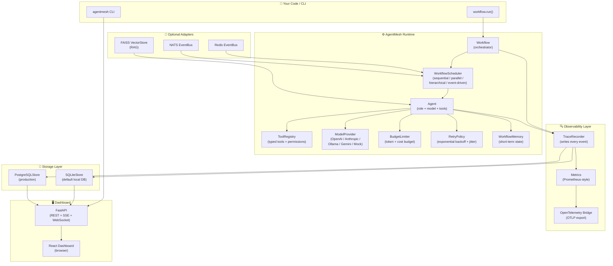

---

## 5. How a Workflow Run Works — Step by Step

Here is exactly what happens when you call `workflow.run()`:

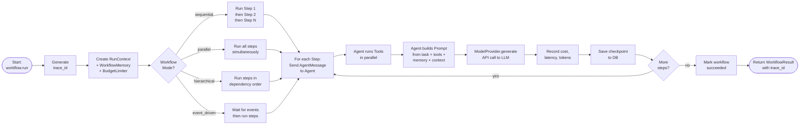

**Key insight:** At every arrow in this diagram, an event is written to the database. By the time you see `trace_id`, the entire run is already recorded and inspectable in the dashboard.

---

## 6. Sequence Diagram: Running a Multi-Agent Workflow

This shows the exact sequence of calls for a **Researcher → Writer → Reviewer** workflow:

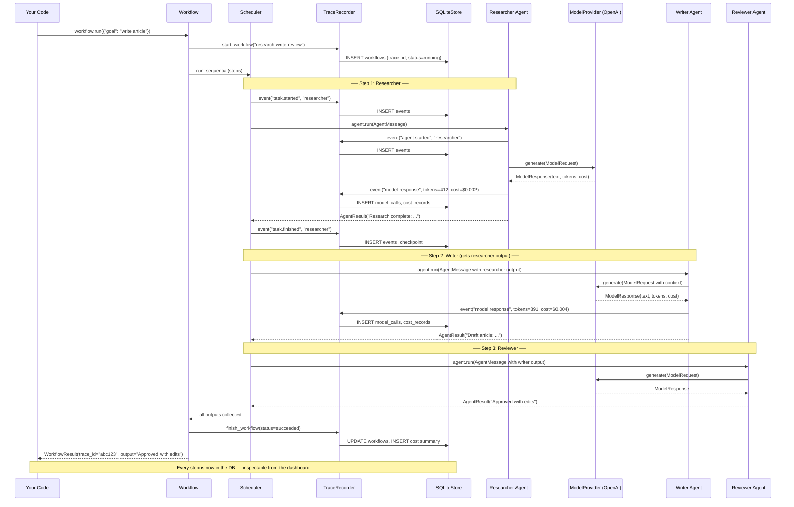

---

## 7. Parallel vs Sequential Execution

AgentMesh supports 4 workflow modes. Here's how they look:

### Sequential — one after another

```mermaid
gantt
    title Sequential Workflow (total = sum of all steps)
    dateFormat X
    axisFormat %s

    section Agents
    Researcher  : 0, 3
    Writer      : 3, 6
    Reviewer    : 6, 8
```

### Parallel — all at once

```mermaid
gantt
    title Parallel Workflow (total = longest step)
    dateFormat X
    axisFormat %s

    section Agents
    Researcher  : 0, 3
    Writer      : 0, 5
    Reviewer    : 0, 2
```

### Hierarchical — dependency-based

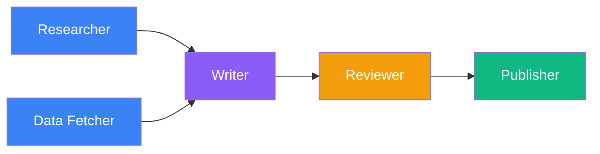

A and B run in parallel. C waits for both. D waits for C. E waits for D. Each `depends_on` in `add_step()` controls this graph.

### Event-Driven — triggered by events

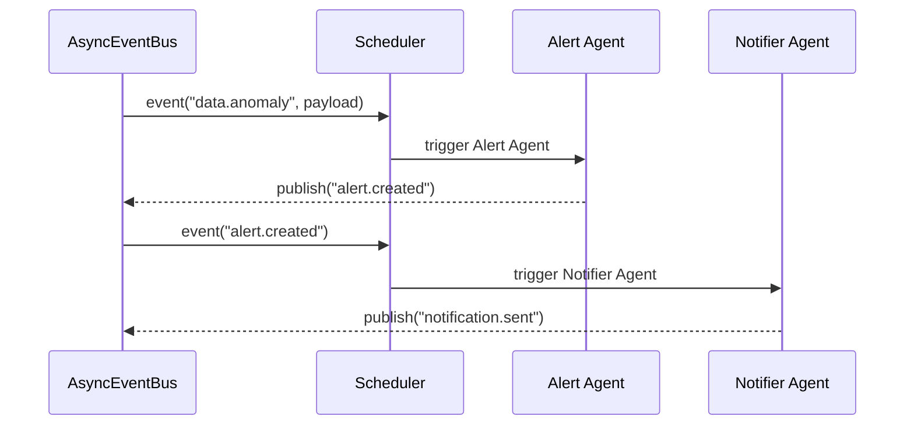

---

## 8. Tool Execution and Human Approval Flow

Tools are functions your agents can call — like searching the web, reading a file, or sending an email. Sensitive tools can require a human to approve before they run.

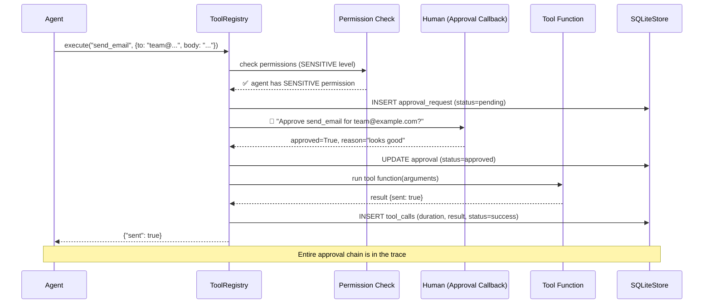

**If a tool is rejected:**

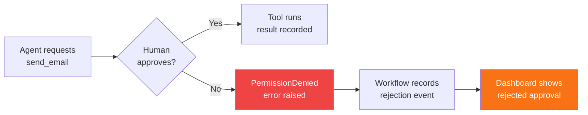

---

## 9. How Tracing Works

Every single thing that happens in a workflow gets recorded as a **span** (a timed unit of work) nested inside a **trace** (the full run). This is similar to how a medical chart records every procedure during a hospital visit.

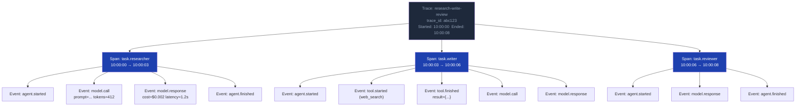

**Every recorded field for a model call:**
- Prompt text (what the agent was told)
- Model name and provider
- Token counts (prompt, completion, cached, reasoning)
- Latency in milliseconds
- Estimated cost in USD
- Error details (if it failed)
- Request ID (from the provider)
- Parent span ID (which task triggered this call)

**What happens in the database:** Every event is a row in the `events` table. The dashboard queries these rows and reconstructs the visual timeline you see in the Trace Explorer.

---

## 10. RAG (Retrieval-Augmented Generation) Flow

RAG means giving your agent access to a document library. Instead of relying only on what the AI model knows, the agent first searches your documents, then uses what it finds to answer better.

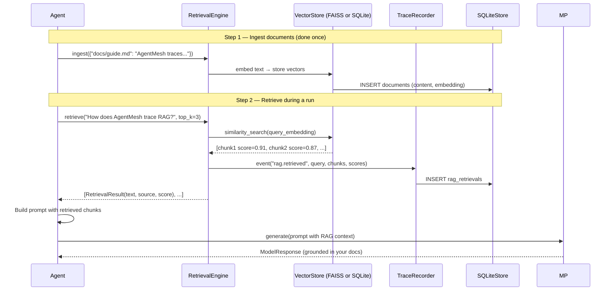

**In the dashboard** — the Memory & RAG page shows:
- Which query triggered each retrieval
- Which chunks were returned and their similarity scores
- Which source documents were used
- How this affected the final model answer

---

## 11. Cost Tracking Flow

AgentMesh automatically measures what every LLM call costs and accumulates it into a budget.

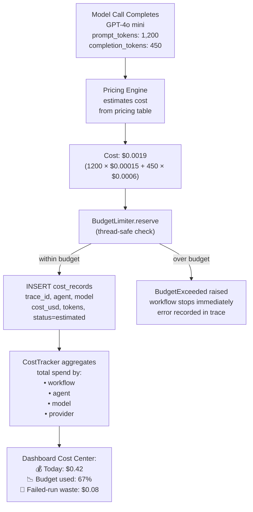

**Cost statuses:**

| Status | Meaning |
|---|---|
| `exact` | Provider reported the exact cost |
| `estimated` | Calculated from local pricing rules |
| `local/free` | Ollama, vLLM, or Mock — no cloud cost |
| `unknown` | No pricing rule found for this model |

**Set a budget to automatically stop runaway agents:**
```python
budget = BudgetLimiter(max_cost_usd=0.50, max_total_tokens=100_000)
workflow = Workflow("my-workflow", budget=budget)
```

The moment an agent exceeds $0.50 total, the workflow raises `BudgetExceeded` and stops — no surprise bills.

---

## 12. Replay and Time-Travel Debugging

This is one of AgentMesh's most powerful features. Because every prompt, response, tool call, and memory state is recorded, you can:

1. **Replay** a past run without calling real LLMs (deterministic)
2. **Fork** from any checkpoint and change the memory
3. **Diagnose** exactly which step failed and why

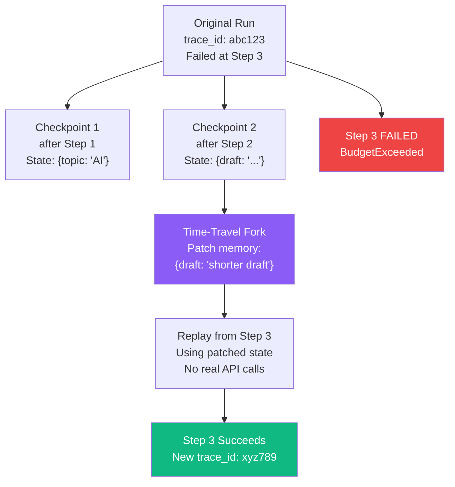

**Three replay modes:**

| Mode | What it does | Real API calls? |
|---|---|---|
| `deterministic` | Uses recorded model outputs and tool results | ❌ None |
| `simulated` | Uses mock outputs matching the original shape | ❌ None |
| `live` | Calls real providers/tools — may get different results | ✅ Yes |

```bash
# Safe replay — no API costs
agentmesh replay abc123 --mode deterministic

# Fork from a checkpoint and patch memory
agentmesh checkpoints list abc123
agentmesh checkpoints patch-memory ckpt_456 --set '{"draft": "shorter version"}'

# Diagnose what went wrong
agentmesh diagnose abc123
```

---

## 13. Dashboard Request-Response Flow

This shows exactly what happens when you open the AgentMesh dashboard in your browser.

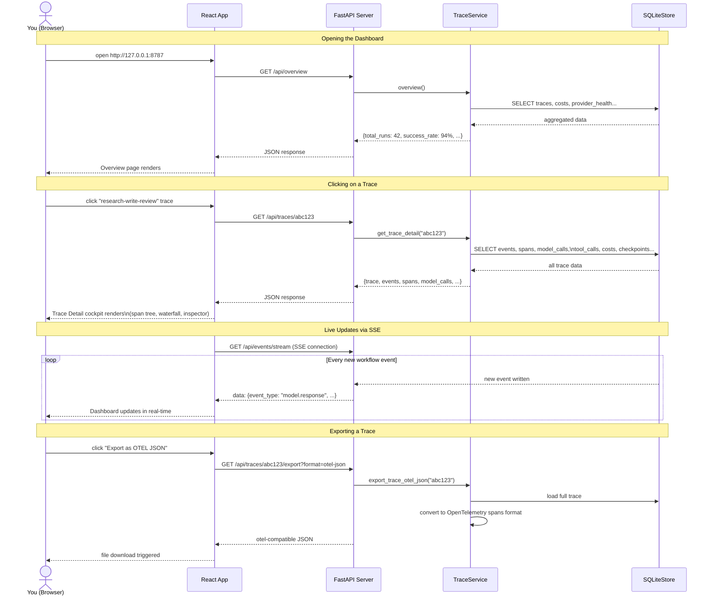

### Dashboard API Endpoints at a Glance

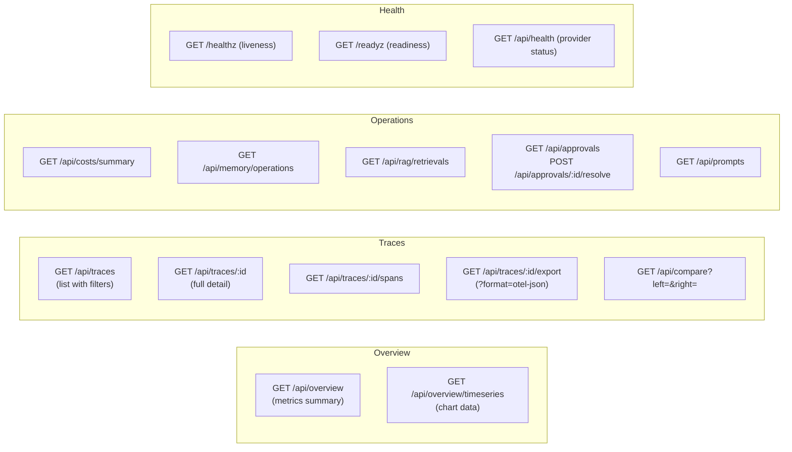

---

## 14. Storage and Data Model

AgentMesh stores everything in SQLite (default) or PostgreSQL. Here is the data model:

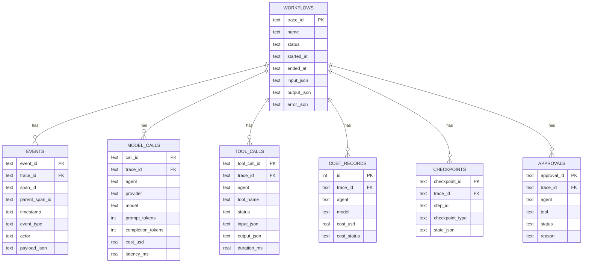

**How the data flows:**

```
workflow.run() called
      │
      ├─► INSERT workflows (status=running)
      │
      │   (for each agent step)
      ├─► INSERT events (agent.started, model.call, model.response, agent.finished)
      ├─► INSERT model_calls (one row per LLM call)
      ├─► INSERT tool_calls (one row per tool execution)
      ├─► INSERT cost_records (one row per model call)
      ├─► INSERT checkpoints (before + after each step)
      │
      └─► UPDATE workflows (status=succeeded/failed)
```

All of this happens automatically — you write `workflow.run()`, AgentMesh handles the rest.

---

## 15. Real-World Use Cases

### Use Case 1: Customer Support Automation

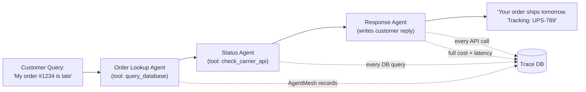

**What AgentMesh gives you:**
- Which step caused slow responses (latency by span)
- What the DB query returned (tool call inspector)
- How much each customer interaction costs (cost per trace)
- Why a reply was wrong (replay with the exact recorded prompt)

---

### Use Case 2: Research and Report Generation

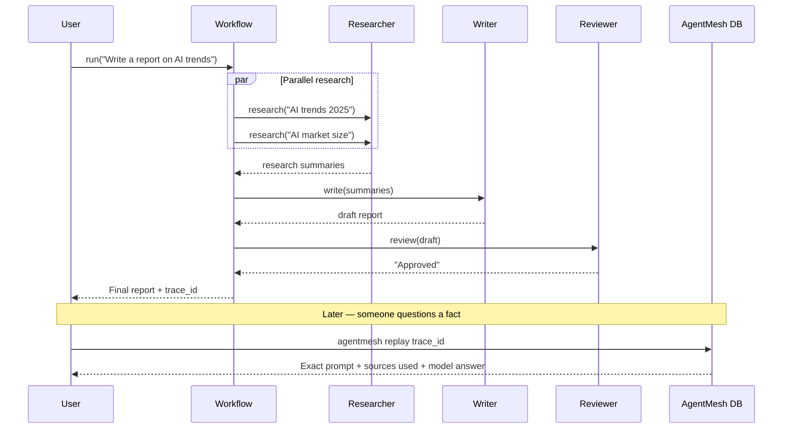

---

### Use Case 3: Code Review Pipeline

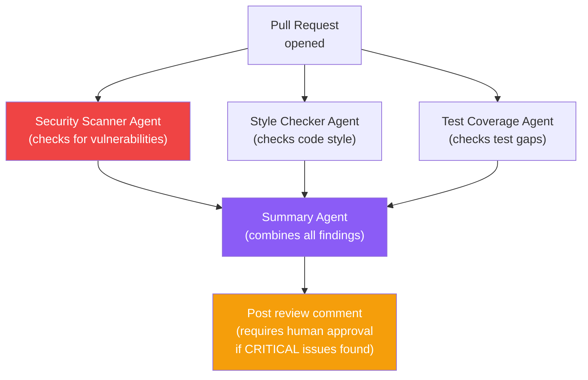

**With AgentMesh:**
- The `send_comment` tool requires `requires_approval=True` when security issues are critical
- A human reviews the findings before the comment is posted
- The entire decision trail is in the audit log

---

### Use Case 4: Data Processing with Cost Control

```python
# Stop if this run costs more than $2
budget = BudgetLimiter(max_cost_usd=2.00)
workflow = Workflow("nightly-analysis", budget=budget)
```

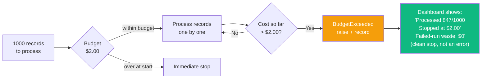

---

## 16. What Makes AgentMesh Different

Most tools either **orchestrate** AI agents OR **observe** them. AgentMesh does both in one package.

```mermaid
flowchart LR
    subgraph OTHERS["Other Tools"]
        direction TB
        LC["LangChain\nOrchestrates\nbut limited observability"]
        LS["LangSmith\nObserves\nbut doesn't orchestrate"]
        LF["LangFuse\nObserves LLM calls\nbut not full workflows"]
    end

    subgraph AM["AgentMesh"]
        direction TB
        ORCH["Orchestrates workflows\n(sequential/parallel/hierarchical)"]
        OBS["Observes everything\n(traces/costs/replay)"]
        ORCH <--> OBS
    end

    style AM fill:#1e293b,color:#94a3b8
    style ORCH fill:#3b82f6,color:#fff
    style OBS fill:#8b5cf6,color:#fff
```

**Key differentiators:**

| Feature | What it means for you |
|---|---|
| **One package for orchestration + observability** | No need to wire two separate systems together |
| **Local-first** | Your prompts and data never leave your machine by default |
| **Zero config** | `pip install -e .` + one command and you have a working dashboard |
| **Deterministic replay** | Re-run without API costs — great for debugging and CI |
| **Time-travel checkpoints** | Go back to any step, change memory, continue |
| **Human approval gates** | Any tool can require approval before running |
| **Budget enforcement** | Hard stop if costs exceed limits — no surprise bills |
| **Works with any LLM** | OpenAI, Anthropic, Gemini, Ollama, vLLM, Azure, your own |
| **OpenTelemetry export** | Send traces to Jaeger, Grafana Tempo, Datadog, Honeycomb |

---

## 17. Glossary

| Term | Simple definition |
|---|---|
| **Agent** | An AI worker with a role, instructions, and a model powering it |
| **Workflow** | A plan that coordinates multiple agents and their tasks |
| **Task** | A specific piece of work assigned to one agent |
| **Tool** | A function an agent can call (search, database, email, etc.) |
| **Trace** | The complete recording of one workflow run |
| **Span** | One timed unit of work inside a trace (e.g., one agent step) |
| **Event** | A single recorded moment (model call, tool call, error, etc.) |
| **Checkpoint** | A snapshot of workflow memory saved at each step |
| **Replay** | Re-running a past trace without calling real APIs |
| **Time-Travel** | Forking a workflow from any saved checkpoint |
| **BudgetLimiter** | A hard limit on tokens or dollars spent per run |
| **RetryPolicy** | Rules for automatically retrying failed steps |
| **CircuitBreaker** | Stops trying a provider after too many failures |
| **RAG** | Retrieval-Augmented Generation — searching your documents during a run |
| **VectorStore** | A database that stores document embeddings for similarity search |
| **Embedding** | A numeric representation of text used for similarity comparisons |
| **MockModelProvider** | A fake AI model that returns preset answers — used for testing |
| **OTEL / OpenTelemetry** | An industry standard for traces and metrics that tools like Jaeger and Datadog understand |
| **SQLite** | A local file-based database — AgentMesh's default storage |
| **Trace ID** | A unique ID for one workflow run — use it to find anything in the dashboard |
| **Dashboard** | The local web UI that shows traces, costs, tools, memory, and replays |
| **SSE** | Server-Sent Events — how the dashboard receives live updates from running workflows |
| **Approval Gate** | A pause where a human must approve before a sensitive tool executes |

---

## Quick Reference: Key Files

```
AgentMesh/
├── src/agentmesh/
│   ├── agents.py          # Agent class — runs tasks, calls tools and models
│   ├── workflow.py        # Workflow class — coordinates agents
│   ├── scheduler.py       # WorkflowScheduler — sequential/parallel/hierarchical execution
│   ├── providers.py       # 7 model providers (OpenAI, Anthropic, Gemini, Ollama, vLLM, Mock)
│   ├── tools.py           # Tool registry, permissions, approval flow
│   ├── storage.py         # SQLiteStore — all database reads and writes
│   ├── observability.py   # TraceRecorder — captures every event
│   ├── reliability.py     # RetryPolicy, BudgetLimiter, CircuitBreaker, RateLimiter
│   ├── rag.py             # RetrievalEngine, FAISS and SQLite vector stores
│   ├── debug.py           # ReplayEngine, TimeTravelDebugger, FailedRunDiagnosis
│   ├── dashboard.py       # FastAPI server — all REST endpoints
│   ├── cli.py             # Command-line interface
│   └── memory.py          # WorkflowMemory, SQLiteMemoryStore
├── dashboard/src/         # React + TypeScript frontend
├── examples/              # 20 runnable example workflows
├── tests/                 # pytest test suite
└── docs/                  # Reference documentation
```

---

*This document was written to be understandable to someone new to AI agent systems. If something is still unclear, please open a [GitHub Discussion](https://github.com/raghuece455/AgentMesh/discussions) — feedback improves this guide for everyone.*
