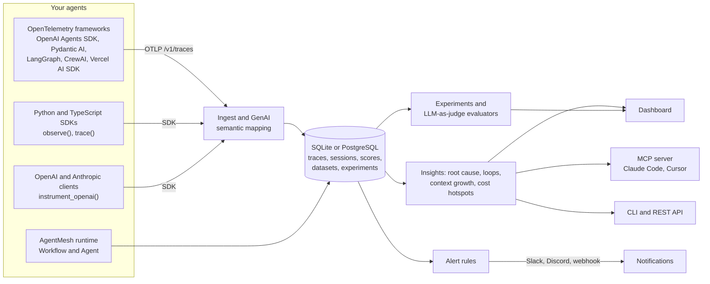

# AgentMesh

[](https://github.com/raghuece455/AgentMesh/actions/workflows/ci.yml)
[](https://opensource.org/licenses/MIT)
[](https://www.python.org/downloads/)
[](CHANGELOG.md)
[](docs/integrations.md)
[](docs/mcp.md)
[](CONTRIBUTING.md)

**AgentMesh is free, open-source, self-hosted observability for AI agents: traces, sessions, costs, automatic debugging insights, datasets and LLM-as-judge evaluations, and alerts — for agents built with any framework, in Python or TypeScript.**

Agent runs are hard to debug once prompts, tools, retrieval, retries, sub-agents, and humans start influencing each other. AgentMesh records every run as an inspectable trace so you can answer *what happened*, *which step broke first*, *is it looping*, *how much it cost*, and *where the time went*.

> **Bring your own stack.** Point any OpenTelemetry exporter at AgentMesh (OpenAI Agents SDK, Pydantic AI, LangGraph, CrewAI, Vercel AI SDK, ...), add one decorator to plain Python or TypeScript, or auto-instrument the OpenAI and Anthropic clients. Store traces in SQLite or PostgreSQL. No account, no cloud, MIT licensed.


<sub>A failed support-agent run, traced over OpenTelemetry: AgentMesh points at the first failing tool call, the refund tool being retried in a loop, and the context growing 5× across model calls.</sub>

---

## What you get

- **Works with any framework** — an OTLP/HTTP receiver (`/v1/traces`, JSON or protobuf) that understands the OpenTelemetry GenAI semantic conventions, OpenInference, OpenLLMetry, and Vercel AI SDK attributes. [Integrations →](docs/integrations.md)
- **Python SDK** — `@agentmesh.observe`, `agentmesh.trace(session_id=..., user_id=...)`, `agentmesh.score(...)`; sync, async, and generators. [SDK →](docs/sdk.md)
- **TypeScript SDK** — `npm install agentmesh-sdk`: `observe()`, `trace()`, `score()`, `instrumentOpenAI()`, `instrumentAnthropic()`, and `runExperiment()` for Node.js agents. [TypeScript →](docs/typescript-sdk.md)
- **Auto-instrumentation** — `instrument_openai()` and `instrument_anthropic()`: Chat Completions, Responses, Embeddings, Messages, streaming, tool calls, cache and reasoning tokens.
- **Automatic insights** — first failure with its causal path, tool-call loops, repeated identical prompts, runaway context growth, prompt-cache hit rate, self-time and cost hotspots.
- **Sessions and users** — multi-turn conversations grouped by `gen_ai.conversation.id`, with every turn's input, output, and feedback.
- **Scores and feedback** — thumbs up/down in the dashboard, `POST /api/scores`, SDK scores, and OTel `gen_ai.evaluation.result` events.
- **Datasets and experiments** — turn traces into test cases with one click, run a new prompt or model over them, and compare item by item: what regressed, what improved, what it cost. Gate releases in CI with `agentmesh experiments run --fail-under`. [Evals →](docs/datasets-and-experiments.md)
- **LLM-as-judge** — `LLMJudge("correctness", judge=...)` with any model, plus exact-match, contains, regex, JSON, and similarity evaluators; score production traces with `evaluate_traces()`.
- **Alerts** — Slack, Discord, or signed webhook notifications for failure spikes, spend, expensive traces, p95 latency, and agents stuck in tool loops. [Alerts →](docs/alerts.md)
- **Accurate cost tracking** — per-million-token pricing with cache-read/cache-write rates, current Claude, GPT, and Gemini prices built in, `agentmesh pricing sync` for everything else.
- **MCP server** — `agentmesh mcp` lets Claude Code, Cursor, or any MCP client list, inspect, diagnose, and score your traces, compare experiments, and check alerts. [MCP →](docs/mcp.md)
- **SQLite or PostgreSQL** — SQLite for a zero-setup local install; `AGENTMESH_DB_URL=postgresql://...` for a shared team server, with every feature on both.
- **Replay and time travel** — deterministic replay and checkpoint forking for workflows built with the AgentMesh runtime.
- **Privacy and retention** — secret redaction, `AGENTMESH_CAPTURE_CONTENT=false`, content truncation, `agentmesh traces prune --older-than 30d`.
- **Optional runtime** — AgentMesh also includes an async multi-agent runtime (workflows, tools with approval gates, budgets, RAG, memory) if you want orchestration and observability in one package.

### How it fits together



---

## Observe an existing agent in 60 seconds

```bash
pip install "agentmesh-ai[otlp]"
agentmesh dashboard            # http://127.0.0.1:8787 — OTLP endpoint at /v1/traces
```

> The PyPI package includes the full React dashboard. Add `[postgres]` for PostgreSQL storage. To run unreleased changes from GitHub, see [Quickstart from source](#quickstart-from-source).

**Option A — any OpenTelemetry-instrumented framework:**

```bash
export OTEL_EXPORTER_OTLP_ENDPOINT="http://127.0.0.1:8787"
python my_agent.py
```

**Option B — plain Python with the SDK:**

```python
import agentmesh

agentmesh.init(service_name="support-bot")     # writes to the local AgentMesh database
agentmesh.instrument_anthropic()               # and/or agentmesh.instrument_openai()

@agentmesh.observe(kind="tool")
def lookup_order(order_id: str) -> dict: ...

@agentmesh.observe(kind="agent")
def support_agent(question: str) -> str: ...

with agentmesh.trace("support-turn", session_id="chat-42", user_id="u-7"):
    answer = support_agent("Where is my order?")
    agentmesh.score("resolved", True)
```

Try it offline: `python examples/sdk_quickstart.py`, then open the **Sessions** and **Traces** pages.

**Option C — TypeScript / Node.js:**

```ts
import OpenAI from "openai";
import { init, instrumentOpenAI, observe, trace } from "agentmesh-sdk";   // npm install agentmesh-sdk

init({ serviceName: "support-bot" });                 // sends to http://127.0.0.1:8787
const openai = instrumentOpenAI(new OpenAI());
const lookupOrder = observe(async (id: string) => ({ id, status: "shipped" }), { kind: "tool", name: "lookup_order" });

await trace("support-turn", { sessionId: "chat-42" }, async () => lookupOrder("A-1001"));
```

**Option D — ask your coding agent:**

```bash
claude mcp add agentmesh -- agentmesh mcp --db /absolute/path/.agentmesh/agentmesh.db
# "Diagnose the most recent failed trace"
```

---

## Test changes before you ship them

Save good (and bad) production answers as a dataset, run the new version over it, and compare:

```python
from agentmesh import Contains, LLMJudge

result = agentmesh.run_experiment(
    "support-regressions",                      # built from traces with "Add to dataset"
    task=support_agent_v2,
    evaluators=[Contains(), LLMJudge("correctness", judge=call_my_llm)],
    name="prompt-v2",
)
print(result.format_summary())
```

```bash
# In CI: fail the build if quality drops or any item regresses against the last release
agentmesh experiments run --dataset support-regressions --task app.py:support_agent_v2 \
  --evaluator contains --fail-under contains=0.9 --baseline exp_1234 --fail-on-regression
```

And get told when production misbehaves:

```bash
agentmesh alerts add --name "tool loops" --kind loop_detected --threshold 4 --webhook https://hooks.slack.com/services/...
agentmesh alerts add --name "checkout failures" --kind failure_rate --threshold 0.2 --window 15m --workflow checkout
```

Try both offline: `python examples/datasets_experiments.py`, then open **Datasets & Evals** and **Alerts**.

---

## Quickstart from source

### Windows PowerShell

```powershell
git clone https://github.com/raghuece455/AgentMesh.git
cd AgentMesh
py -3.13 -m venv .venv
.\.venv\Scripts\Activate.ps1
python -m pip install -e ".[otlp]"
python -m agentmesh.cli demo seed --reset
python -m agentmesh.cli dashboard --host 127.0.0.1 --port 8790
```

### macOS/Linux

```bash
git clone https://github.com/raghuece455/AgentMesh.git
cd AgentMesh
python3 -m venv .venv
source .venv/bin/activate
python -m pip install -e ".[otlp]"
python -m agentmesh.cli demo seed --reset
python -m agentmesh.cli dashboard --host 127.0.0.1 --port 8790
```

Open [http://127.0.0.1:8790](http://127.0.0.1:8790) — you'll see the full dashboard with seeded demo traces.

In a second terminal, run real examples against the live dashboard:

```bash
AGENTMESH_DB_URL=.agentmesh/agentmesh.db python examples/sdk_quickstart.py   # SDK tracing, no API keys
python examples/hello_agent.py
python examples/researcher_writer_reviewer.py
python examples/tool_calling_agent.py
python examples/rag_document_qa.py
python examples/failed_run_debugging.py
```

See [Setup.md](Setup.md) for the full setup guide including provider configuration, Docker, and PostgreSQL.

---

## Docker (one command)

```bash
docker compose up --build
```

Open [http://127.0.0.1:8787](http://127.0.0.1:8787). Demo data is seeded on start (set `AGENTMESH_DEMO_SEED=false` to keep your own traces). The port is published on localhost only; before exposing it, set `AGENTMESH_AUTH_MODE=api_key` and `AGENTMESH_API_KEY` in `.env` — see [docs/docker.md](docs/docker.md).

---

## Built-in Runtime Example

If you are starting a new project, the AgentMesh runtime gives you orchestration with tracing, budgets, approvals, and replay built in:

```python
import asyncio

from agentmesh import Agent, MockModelProvider, Workflow, WorkflowMode


async def main() -> None:
    provider = MockModelProvider(["Draft plan", "Final answer"])
    workflow = Workflow("hello-team", mode=WorkflowMode.SEQUENTIAL)
    workflow.add_agent(Agent("planner", "Planner", "Create a short plan.", provider))
    workflow.add_agent(Agent("writer", "Writer", "Write the final answer.", provider))
    workflow.add_step("planner", "Plan a launch checklist")
    workflow.add_step("writer", "Turn the plan into a concise response")

    result = await workflow.run({"goal": "ship a demo"})
    print(result.trace_id)
    print(result.output)


asyncio.run(main())
```

Replace `MockModelProvider` with `OpenAICompatibleProvider`, `AnthropicProvider`, `OllamaProvider`, or any other provider — traces look identical regardless of which model you use.

---

## Dashboard

The local dashboard is built around production debugging workflows, with a command palette (Ctrl/⌘ K), a global time range, and light and dark themes:

| Page | What you get |
|---|---|
| **Overview** | KPI cards with sparklines (traces, error rate, p95 latency, tokens, cost), trace volume and latency charts, failures grouped into issues, spend by model, provider health |
| **Traces** | Dense searchable table with shareable filters and CSV export; a trace view with the span tree and waterfall in one searchable timeline, automatic insights, a span panel with chat-style input/output, side-by-side comparison with another run, keyboard navigation, export, replay |
| **Sessions** | Multi-turn conversations: every turn's input, output, status, cost, and feedback in order |
| **Datasets & Evals** | Datasets built from traces or by hand, experiment runs with per-evaluator scores, and item-by-item comparison of two runs |
| **Alerts** | Alert rules with live state, one-click test notifications, and alert history |
| **Connect** | Your OTLP endpoint and copy-paste setup for OpenTelemetry, the Python and TypeScript SDKs, OpenAI Agents SDK, Pydantic AI, and MCP |
| **Workflows** | Node graph with agent/task/model/tool/memory/approval nodes, status, retries, cost, latency |
| **Agents** | Role, model/provider, cost/token trends, tool calls, memory operations, errors |
| **Models** | Provider health, calls, token split, cost, latency, p95, error rate, rate limits |
| **Costs** | Spend today/week/month, budget used/remaining, failed-run waste, cache savings |
| **Tools** | Tool call inspector with permissions, approval status, side effects, sandbox logs |
| **Memory & RAG** | Memory operations, versioned records, retrieved chunks, similarity scores, source metadata |
| **Replay** | Deterministic replay of a whole trace or from a selected span; simulated and live modes from the CLI/API |

<table>
  <tr>
    <td width="50%"><br><b>Sessions</b> — every turn of a conversation, with feedback</td>
    <td width="50%"><br><b>Trace detail</b> — timeline, insights, span details</td>
  </tr>
  <tr>
    <td width="50%"><br><b>Overview</b> — KPIs, trends, issues, spend by model</td>
    <td width="50%"><br><b>Workflow graph</b> — agents, model calls, and tools as nodes</td>
  </tr>
  <tr>
    <td width="50%"><br><b>Experiments</b> — what a change improved and what it broke</td>
    <td width="50%"><br><b>Alerts</b> — failures, spend, and loops, to Slack or a webhook</td>
  </tr>
  <tr>
    <td width="50%"><br><b>Costs</b> — spend, budget, failed-run waste, cost by model</td>
    <td width="50%"><br><b>Connect</b> — endpoint and copy-paste setup for your stack</td>
  </tr>
</table>

---

## Architecture

```
AgentMesh
├── Ingestion         OTLP/HTTP receiver (JSON + protobuf), GenAI semconv / OpenInference / OpenLLMetry mapping
├── SDKs              Python and TypeScript: observe, trace, span, score, OpenAI + Anthropic auto-instrumentation
├── Analysis          Root cause, loop detection, context growth, cache usage, hotspots
├── Evaluation        Datasets, experiments, comparisons, built-in and LLM-as-judge evaluators
├── Alerts            Rule scheduler, Slack / Discord / signed webhook delivery
├── MCP Server        Traces as tools for coding agents
├── Core Runtime      Agents, Tasks, Workflows, Scheduler, Event Bus
├── Observability     Tracing, Metrics, Logs, Replay, Cost Tracking, OpenTelemetry
├── Tool Layer        MCP Proxy, Sandboxed Commands, Permissions, Human Approval
├── Memory Layer      Workflow Memory, Long-term Memory, Vector Store, Checkpoints
├── Model Providers   OpenAI-compatible, Ollama, Anthropic, Gemini, vLLM, Router
├── Dashboard         Overview, Trace Explorer, Sessions, Experiments, Alerts, Costs, Workflow Graph, Replay
└── SDK + CLI
```

Key components:

- `Workflow` — schedules steps and owns the run context.
- `WorkflowScheduler` — executes sequential, parallel, dependency-aware, hierarchical, and event-driven workflows.
- `Agent` — receives typed `AgentMessage` objects, executes tools, calls a model provider, returns an `AgentResult`.
- `TraceRecorder` — writes every event to `SQLiteStore` or `PostgreSQLStore` (the same queries on both; see [docs/configuration.md](docs/configuration.md#postgresql)).
- `ReplayEngine` — reconstructs prompts, outputs, tools, agent interactions, memory state, and checkpoints.
- `TimeTravelDebugger` — inspects and forks workflow memory from checkpoints.
- `FailedRunDiagnosis` — classifies failed runs from retries, errors, and budget events.
- `ToolRegistry` — enforces permissions and optional human approval before execution.
- `PluginManager` — registers custom tools, model providers, agents, planners, and evaluators.

---

## Technology Stack

| Layer | Implementation |
|---|---|
| Core | Python 3.11+ |
| API | FastAPI |
| Dashboard frontend | React 19 + TypeScript + TailwindCSS + Recharts + React Flow |
| Workflow engine | AsyncIO |
| Messaging | In-memory event bus; optional Redis and NATS adapters |
| Database | SQLite (default) or PostgreSQL 14+, with the same features on both |
| SDKs | Python; TypeScript/JavaScript (`agentmesh-sdk`, Node.js 18+) |
| Vector DB | FAISS adapter; SQLite vector fallback |
| Tracing | OTLP/HTTP ingestion (OpenTelemetry GenAI semantic conventions); OTEL JSON export |
| Packaging | `pyproject.toml` with uv-compatible dependency groups and extras |
| Testing | pytest (SQLite and PostgreSQL), node:test for the TypeScript SDK |
| Containerization | Dockerfile + Docker Compose |

---

## Provider Support

| Provider | Status |
|---|---|
| Mock (deterministic tests/CI) | ✅ included |
| OpenAI-compatible (`/chat/completions`) | ✅ included |
| Azure OpenAI | ✅ via `OpenAICompatibleProvider` |
| Anthropic Messages API | ✅ included |
| Google Gemini | ✅ included |
| Ollama (local models) | ✅ included |
| vLLM (OpenAI-compatible) | ✅ included |
| Custom provider | ✅ implement `ModelProvider` |
| Model router (cheap/local/coding routes) | ✅ included |

```bash
pip install -e ".[production]"   # all production adapters
pip install -e ".[postgres]"     # PostgreSQL only
pip install -e ".[redis]"        # Redis event bus
pip install -e ".[nats]"         # NATS event bus
pip install -e ".[faiss]"        # FAISS vector store
pip install -e ".[otel]"         # OpenTelemetry export
pip install -e ".[otlp]"         # accept OTLP protobuf on /v1/traces
```

---

## Examples

Runnable examples covering all major features:

```
examples/
├── sdk_quickstart.py               # Trace plain Python with the SDK (offline)
├── datasets_experiments.py         # Traces -> dataset -> two versions -> comparison (offline)
├── otel_genai_export.py            # Standard OpenTelemetry GenAI spans -> AgentMesh
├── llm_client_auto_instrumentation.py  # instrument_openai() / instrument_anthropic()
├── hello_agent.py                  # Single-agent workflow
├── researcher_writer_reviewer.py   # 3-agent sequential pipeline
├── parallel_multi_agent.py         # Parallel execution
├── tool_calling_agent.py           # Agent with typed tools
├── rag_document_qa.py              # RAG with tracing
├── human_approval_workflow.py      # Approval gates
├── cost_budget_workflow.py         # Budget constraints
├── failed_run_debugging.py         # Failure diagnosis
├── time_travel_debugging.py        # Replay from checkpoint
├── multi_model_routing.py          # Dynamic provider routing
├── ollama_local_model.py           # Local LLM
├── openai_compatible_provider.py   # Generic OpenAI API
└── ...
sdks/typescript/examples/
├── quickstart.mjs                  # Trace a Node.js agent with sessions and scores
└── experiment.mjs                  # Run and grade an experiment from TypeScript
```

---

## CLI

```bash
agentmesh init
agentmesh run examples/research_team.py
agentmesh dashboard                                   # also serves OTLP at /v1/traces
agentmesh mcp                                         # MCP server over stdio
agentmesh demo seed
agentmesh ingest trace.otlp.json                      # import an OTLP/JSON file
agentmesh sessions list
agentmesh sessions show <session_id>
agentmesh traces list
agentmesh traces show <trace_id>
agentmesh traces insights <trace_id>                  # root cause, loops, context growth, hotspots
agentmesh traces prune --older-than 30d [--dry-run]
agentmesh datasets import support-regressions items.jsonl
agentmesh datasets add-trace support-regressions <trace_id>
agentmesh experiments run --dataset support-regressions --task app.py:answer --evaluator exact_match --fail-under exact_match=0.9
agentmesh experiments compare <baseline_id> <candidate_id>
agentmesh alerts add --name "daily spend" --kind cost --threshold 50 --window 1d --webhook <url>
agentmesh alerts check                                # evaluate rules once (e.g. from cron)
agentmesh pricing show claude-sonnet-5
agentmesh pricing sync
agentmesh traces export <trace_id> --out trace.json
agentmesh traces export <trace_id> --format otel-json --out trace.otel.json
agentmesh replay <trace_id> --mode deterministic
agentmesh replay <trace_id> --mode simulated
agentmesh replay <trace_id> --mode live --allow-side-effects
agentmesh diagnose <trace_id>
agentmesh costs summary
agentmesh costs summary --dimension model
agentmesh checkpoints list <trace_id>
agentmesh checkpoints show <checkpoint_id>
agentmesh doctor
agentmesh validate traces
agentmesh version
```

---

## Security Model

- Secrets (API keys, bearer tokens, private keys, credentials in URLs) are redacted before traces are stored, exported, or mirrored to a collector.
- Optional API-key auth (`AGENTMESH_AUTH_MODE=api_key`) covers the dashboard, REST API, live event stream, WebSocket, and `/v1/traces`; the dashboard prompts for the key.
- `AGENTMESH_CAPTURE_CONTENT=false` keeps prompt/response text, tool arguments, and retrieval queries out of storage; `/v1/traces` enforces a request size limit.
- Tools declare permission levels (`READ`, `WRITE`, `EXECUTE`, `SENSITIVE`), and sensitive tools can require human approval before execution.
- Tool execution and memory writes create audit records; `agentmesh traces prune` enforces retention.
- Alert webhooks can be signed (HMAC-SHA256), never follow redirects, and their URLs and secrets are masked in the API and dashboard.

See [SECURITY.md](SECURITY.md) for the full security policy and reporting instructions.

---

## Project Status

`v0.4.1` — alpha. Ingestion, SDK, dashboard, and runtime are ready for local development, evaluation, and single-team self-hosting.

**Implemented:** OTLP/HTTP trace ingestion with GenAI semantic-convention mapping, Python and TypeScript tracing SDKs, OpenAI and Anthropic auto-instrumentation, sessions/users/tags, scores and feedback, automatic trace insights, datasets, experiments and LLM-as-judge evaluators, alerts with Slack/Discord/webhook delivery, MCP server, per-MTok pricing with cache rates and community price sync, retention pruning, SQLite and PostgreSQL storage, React dashboard (trace explorer, sessions, datasets & evals, alerts, connect, workflow graph, cost center, tools, memory & RAG, replay studio), AgentMesh runtime, CLI, Docker, CI.

**Partial:** Dashboard auth is API-key only (no user accounts); the alert scheduler runs inside one server process; no gRPC OTLP receiver (use a Collector).

**Planned:** OTLP logs, ClickHouse for very high trace volumes, scheduled online evaluation on the server, more client auto-instrumentation, login and RBAC. See [ROADMAP.md](ROADMAP.md).

---

## FAQ

**Do I have to build my agent with AgentMesh?**
No. Send OpenTelemetry traces from any framework, wrap your own code with `@agentmesh.observe`, or instrument the OpenAI/Anthropic clients. The runtime is optional.

**Does my data leave my machine?**
Not unless you send it somewhere. Traces go to a local SQLite file, the dashboard runs locally, and AgentMesh has no telemetry of its own. Set `AGENTMESH_CAPTURE_CONTENT=false` to keep prompt and response text out of storage entirely.

**Is it really free?**
Yes, MIT licensed, with no paid tier or usage limits. You pay only your model providers.

**How accurate are the costs?**
Token counts come from the provider responses. Prices are list prices per million tokens, including prompt-cache read/write rates; `agentmesh pricing show <model>` tells you which rule applied, and `agentmesh pricing sync` refreshes prices for models not built in. Batch discounts and negotiated rates are not applied; override them with `AGENTMESH_PRICING_JSON`.

**Can my team share one instance?**
Yes: run it with `AGENTMESH_AUTH_MODE=api_key` and `AGENTMESH_DB_URL=postgresql://...` behind a TLS reverse proxy and point everyone's exporters at it. There are no per-user accounts yet.

**How do I know a prompt or model change didn't make things worse?**
Save representative traces to a dataset (**Add to dataset** on any trace), then run `agentmesh.run_experiment` (or `agentmesh experiments run` in CI) for the old and new version and compare them in **Datasets & Evals**. See [docs/datasets-and-experiments.md](docs/datasets-and-experiments.md).

**My agents are in TypeScript. Does this work?**
Yes. Use `agentmesh-sdk` from npm, or any OpenTelemetry exporter (the Vercel AI SDK's telemetry works as-is). See [docs/typescript-sdk.md](docs/typescript-sdk.md).

---

## Contributing

Contributions are welcome. See [CONTRIBUTING.md](CONTRIBUTING.md) for setup instructions, development workflow, and contribution areas.

Good first issues are labeled [`good first issue`](https://github.com/raghuece455/AgentMesh/issues?q=label%3A%22good+first+issue%22) in the issue tracker.

---

## Documentation

| Document | What it covers |
|---|---|
| [docs/integrations.md](docs/integrations.md) | Trace any framework over OpenTelemetry — recipes and attribute mapping |
| [docs/sdk.md](docs/sdk.md) | Python SDK and OpenAI/Anthropic auto-instrumentation |
| [docs/typescript-sdk.md](docs/typescript-sdk.md) | TypeScript/JavaScript SDK (`agentmesh-sdk`) |
| [docs/datasets-and-experiments.md](docs/datasets-and-experiments.md) | Datasets, experiments, evaluators, LLM-as-judge, CI gating |
| [docs/alerts.md](docs/alerts.md) | Alert rules and Slack / Discord / webhook notifications |
| [docs/mcp.md](docs/mcp.md) | MCP server for Claude Code, Cursor, and other MCP clients |
| [Setup.md](Setup.md) | Full setup guide — providers, Docker, PostgreSQL, troubleshooting |
| [HOW_IT_WORKS.md](HOW_IT_WORKS.md) | Deep dive — architecture, sequence diagrams, data flow, use cases |
| [ROADMAP.md](ROADMAP.md) | Planned milestones — v0.4, v0.5, v1.0 |
| [CONTRIBUTING.md](CONTRIBUTING.md) | How to contribute — setup, dev principles, adding providers |
| [docs/](docs/) | Reference docs — agents, tools, memory, CLI, dashboard, OTEL |

---

## Community

- [GitHub Discussions](https://github.com/raghuece455/AgentMesh/discussions) — questions, ideas, show and tell
- [GitHub Issues](https://github.com/raghuece455/AgentMesh/issues) — bug reports and feature requests
- [CONTRIBUTING.md](CONTRIBUTING.md) — how to contribute

If AgentMesh is useful to you, a ⭐ on GitHub helps others find it.

---

## License

MIT. See [LICENSE](LICENSE).
