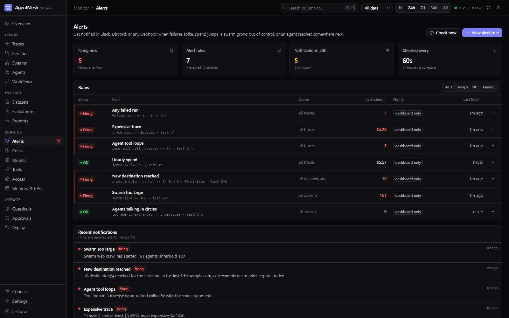

# Alerts

Get a Slack, Discord, or webhook notification when agents start failing, spend jumps, a single run gets expensive, latency degrades, an agent gets stuck in a loop, a swarm grows out of control, or something reaches a host you have never seen before.



---

## Rule kinds

| Kind | Fires when | Threshold unit |
|---|---|---|
| `failure_rate` | Share of runs that failed in the window reaches the threshold (needs `min_runs`, default 5) | fraction, 0-1 |
| `failure_count` | Failed runs in the window reach the threshold | runs |
| `cost` | Total spend in the window reaches the threshold | USD |
| `trace_cost` | Any single trace in the window costs at least the threshold | USD |
| `latency_p95` | p95 run duration in the window reaches the threshold (needs `min_runs`) | milliseconds |
| `loop_detected` | A trace called the same tool with the same arguments at least N times (N ≥ 2) | calls |

Runs are traces from every source: the OTLP endpoint, the Python and TypeScript SDKs, and the AgentMesh runtime.

**Aggregate rules** (`failure_rate`, `failure_count`, `cost`, `latency_p95`) notify when the threshold is crossed, remind every `cooldown` while it stays crossed, and send a **resolved** notification when it recovers. **Per-item rules** (`trace_cost`, `loop_detected`, and every kind in the next section) notify once for each new offending trace, destination, or swarm, and never resolve — an anomaly happened, it does not unhappen. Up to five ids travel with the notification, as dashboard links when `AGENTMESH_PUBLIC_URL` is set.

Filters narrow a rule to part of your traffic: `workflow`, `environment` (`deployment.environment.name`), `service` (`service.name`), and `source` (`otlp`, `sdk`, `runtime`, `file`).

---

## Swarm and egress anomalies

A run spread over hundreds of agents and dozens of processes fails differently: nothing errors, the fleet just grows, spends, argues with itself, or wanders somewhere it has never been. These kinds watch for that.

| Kind | Fires when | Threshold unit |
|---|---|---|
| `new_destination` | A host or resource was reached in the window that AgentMesh had never recorded before, after at least N accesses | accesses |
| `swarm_agents` | One swarm has started at least N agents | agents |
| `swarm_spawn_rate` | One swarm is starting at least N agents per minute | agents/minute |
| `swarm_cost` | One swarm has spent at least N | USD |
| `swarm_errors` | One swarm has at least N failed traces | traces |
| `swarm_loop` | Two agents in a swarm have exchanged at least N messages **in both directions** (N ≥ 2) | messages |

Extra filters for these kinds: `swarm` (id or name, `*` allowed) and, for `new_destination`, `access_kind` (`network`, `retrieval`, `memory`, `db`, `file`, `api`, `other`). `workflow`, `source`, and `min_runs` do not apply and are rejected — a swarm is not one workflow.

Things worth knowing:

- **A swarm kind measures the swarm's totals, across every process in it.** The window decides which swarms are looked at (those active in it), not how far back the count goes. Up to 200 swarms, most recently active first, are checked at a time.
- **One notification names at most 50 offenders.** Anything over that is reported by the next check rather than dropped, so a burst of new destinations arrives as a few readable alerts instead of one wall of text.
- **"New" means new to this AgentMesh**, not new to the filter. A host your swarm reached for the first time still counts as known if another service called it last week. The first check after you create a `new_destination` rule reports everything reached in its window — that is your baseline.
- **`swarm_loop` needs work coming back.** A coordinator messaging fifty workers is delegation; A → B → A → B is a loop. Only pairs that sent messages both ways count.
- **Alerts tell a person; they stop nothing.** To halt a swarm that is growing out of control, give it `swarm:` limits in a policy — see [swarms.md](swarms.md#swarm-wide-limits) and [guardrails.md](guardrails.md). Many teams run both: a limit to stop it, an alert to say so.

```bash
agentmesh alerts add --name "unknown egress" --kind new_destination --threshold 1 --access-kind network --webhook https://hooks.slack.com/services/T000/B000/XXXX

agentmesh alerts add --name "swarm runaway" --kind swarm_agents --threshold 500 --swarm "research-*"
agentmesh alerts add --name "spawn spike" --kind swarm_spawn_rate --threshold 120
agentmesh alerts add --name "agents in circles" --kind swarm_loop --threshold 10
```

---

## Create rules

**Dashboard:** open **Alerts**, fill in **New alert rule**, and use **Test** to send a sample notification.

**CLI:**

```bash
agentmesh alerts add --name "checkout failures" --kind failure_rate --threshold 0.2 --window 15m \
  --workflow checkout --environment production \
  --webhook https://hooks.slack.com/services/T000/B000/XXXX

agentmesh alerts add --name "runaway run" --kind trace_cost --threshold 2 --window 1h \
  --webhook https://discord.com/api/webhooks/123/abc

agentmesh alerts add --name "tool loops" --kind loop_detected --threshold 4 \
  --webhook https://ops.example.com/agentmesh --secret "$WEBHOOK_SECRET"

agentmesh alerts list
agentmesh alerts test "checkout failures"
agentmesh alerts update "checkout failures" --threshold 0.3 --disable
agentmesh alerts history --rule "checkout failures"
agentmesh alerts remove "tool loops"
```

**API:**

```bash
curl -X POST http://127.0.0.1:8787/api/alerts/rules -H 'Content-Type: application/json' -d '{
  "name": "daily spend", "kind": "cost", "threshold": 50, "window": "1d", "cooldown": "6h",
  "channel": {"url": "https://hooks.slack.com/services/T000/B000/XXXX"}
}'
```

Windows and cooldowns accept minutes (`90`) or `15m`, `2h`, `1d`. Defaults: window 15m, cooldown 30m. A rule without a webhook still records alerts, shown on the dashboard. When you change a rule's webhook URL without giving a format, the format is detected again from the new URL.

## When rules are checked

The server evaluates enabled rules every `AGENTMESH_ALERT_INTERVAL_SECONDS` (default `60`). Set it to `0` to turn the scheduler off and run checks yourself, for example from cron or a CI job:

```bash
agentmesh alerts check            # evaluate once and send notifications
agentmesh alerts check --no-deliver
```

Run the scheduler in one server process only. With several replicas, set `AGENTMESH_ALERT_INTERVAL_SECONDS=0` on all but one, or run `agentmesh alerts check` on a schedule instead.

## Webhook payloads

The format is detected from the URL (`hooks.slack.com` → Slack, `discord.com` → Discord) or set with `--format` / `channel.format`.

**Slack** receives `{"text": "*[AgentMesh] FIRING: checkout failures*\nFailure rate 42% (11 of 26 runs) in the last 15m; threshold 20% [workflow=checkout]"}`.

**Discord** receives an embed with the same title and message, colored red for firing and green for resolved.

**JSON** (any other URL):

```json
{
  "type": "agentmesh.alert",
  "alert_id": "alertev_3f9c...",
  "status": "firing",
  "rule": {"rule_id": "alert_...", "name": "tool loops", "kind": "loop_detected", "threshold": 4, "window_minutes": 15, "filters": {}},
  "value": 6,
  "threshold": 4,
  "message": "Tool loop in 1 trace(s): issue_refund called 6x with the same arguments",
  "details": {"traces": [{"trace_id": "0af7651916cd43dd8448eb211c80319c", "tool_name": "issue_refund", "repeats": 6}]},
  "created_at": "2026-09-14T08:42:05+00:00",
  "links": ["https://agentmesh.example.com/?trace=0af7651916cd43dd8448eb211c80319c"]
}
```

`status` is `firing`, `resolved`, or `test`. Per-item rules also carry `details.items` — one entry per offending trace, destination, or swarm:

```json
{
  "status": "firing",
  "message": "Swarm web crawl has started 161 agents; threshold 100",
  "value": 161,
  "details": {"swarms": 2, "items": [{"swarm_id": "swarm_9f2c...", "swarm_name": "web crawl", "value": 161}]},
  "links": ["https://agentmesh.example.com/?page=swarms&swarm=swarm_9f2c..."]
}
```

### Verify signatures

With a secret, each request carries `X-AgentMesh-Timestamp` and `X-AgentMesh-Signature: sha256=<hex>`, an HMAC-SHA256 of `"<timestamp>.<raw body>"`:

```python
import hashlib, hmac, time

def verify(body: bytes, timestamp: str, signature: str, secret: str) -> bool:
    if abs(time.time() - int(timestamp)) > 300:
        return False
    expected = hmac.new(secret.encode(), timestamp.encode() + b"." + body, hashlib.sha256).hexdigest()
    return hmac.compare_digest(signature, f"sha256={expected}")
```

## Delivery and security

- Delivery uses a 10-second timeout and retries once on network errors, HTTP 429, and 5xx. Redirects are not followed. The outcome (`delivered` or the error) is stored with each alert.
- Webhook URLs and secrets are masked in API responses and the dashboard. Updating a rule with the masked values keeps the stored ones.
- Only `http` and `https` URLs are accepted. Creating rules requires the API key when `AGENTMESH_AUTH_MODE=api_key`; enable it before exposing the server, because the server sends requests to the URLs in rules.

## REST API

| Method | Path | Purpose |
|---|---|---|
| GET | `/api/alerts/kinds` | Rule kinds, their groups (Runs, Access, Swarms), and the check interval |
| GET | `/api/alerts/rules` | Rules with state, last value, last fired |
| POST | `/api/alerts/rules` | Create a rule |
| PATCH | `/api/alerts/rules/{rule_id_or_name}` | Change threshold, window, cooldown, filters, channel, or `enabled` |
| DELETE | `/api/alerts/rules/{rule_id_or_name}` | Delete a rule |
| POST | `/api/alerts/rules/{rule_id_or_name}/test` | Send a test notification |
| POST | `/api/alerts/check?deliver=true` | Evaluate all rules now |
| GET | `/api/alerts/events?rule=&limit=` | Alert history |

The MCP server's `list_alerts` tool returns rules and recent alerts, so a coding agent can see what is firing while it debugs.
