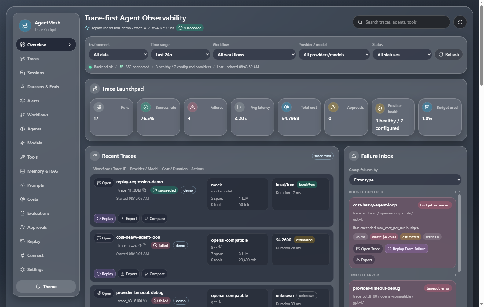
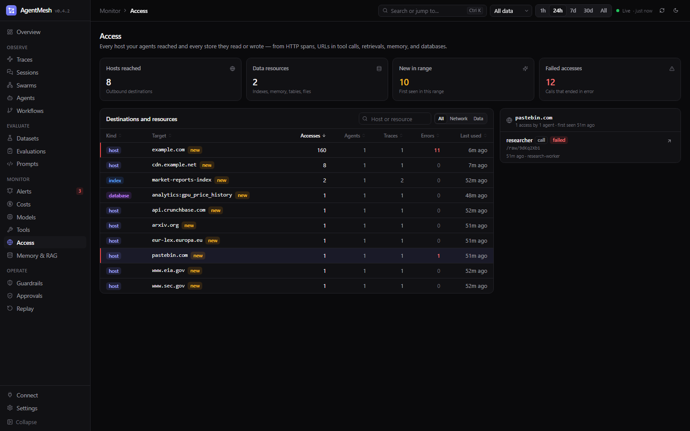
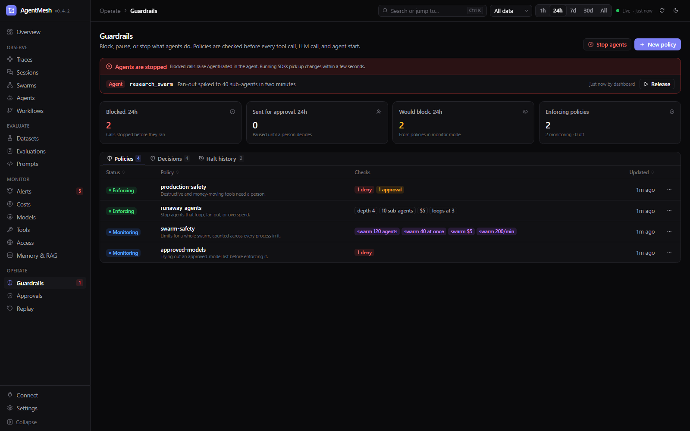

# Dashboard

The AgentMesh local dashboard is a production-oriented debugging console. Every page is built around a real use case: diagnosing a failure, understanding cost, reviewing an approval, or replaying a broken run.

---

## Starting the Dashboard

```bash
agentmesh dashboard
```

Or with explicit host and port:

```bash
agentmesh dashboard --host 127.0.0.1 --port 8787
```

Open [http://127.0.0.1:8787](http://127.0.0.1:8787) in your browser.

---

## Seeding Demo Data

To explore the dashboard with realistic data before running your own workflows:

```bash
agentmesh demo seed --reset
```

This populates the database with a set of pre-built traces covering successful runs, failures, retries, RAG retrievals, and approval events.

---

## Layout and Navigation

- **Sidebar** groups pages by job: *Observe* (Traces, Sessions, Swarms, Agents, Workflows), *Evaluate* (Datasets, Evaluations, Prompts), *Monitor* (Alerts, Costs, Models, Tools, Access, Memory & RAG), and *Operate* (Guardrails, Approvals, Replay). Badges show firing alerts, active halts, and pending approvals. Collapse it to icons with **Collapse**.
- **Time range** (1h, 24h, 7d, 30d, All) and **data scope** (all data, real runs, demo only) in the top bar apply to every page. The range is kept in the address bar as `&range=7d`.
- **Search** with **Ctrl K** (**⌘ K** on macOS) or **/**: jump to any page, find a trace by name, id, status, error, model, or session, or switch the theme.
- **Keyboard shortcuts** — press **?** for the full list. **g** then a letter goes to a page (**g t** Traces, **g s** Sessions, **g r** Guardrails, **g c** Costs, ...). In a trace, **j** / **k** move between spans, **[** / **]** open the previous or next trace, **c** opens Compare, and **Esc** returns to the list.
- **Live** shows whether the server-sent event stream is connected; the dashboard refreshes shortly after new spans arrive.
- The address bar always points at what you are looking at (`/?page=costs`, `/?trace=<id>`), so you can share a link.

## Dashboard Pages

### Overview

The landing page. Answers: *is everything healthy right now?*



- KPI cards with sparklines: traces, error rate, p95 latency, tokens, cost (with monthly budget used), and a **Needs attention** count of firing alerts, pending approvals, and issues. Click a card to drill in.
- **Trace volume** (successful vs failed per interval) and **Latency** (p95 and average) charts for the selected time range
- **Issues** — failed traces grouped by error type and workflow, with event count, wasted spend, and last seen; click one to open its latest trace
- **Spend by model**, **Recent traces**, **Providers** health, and **Live activity**

### Traces

The core debugging tool. Answers: *what exactly happened in this run?*


The list is a dense, sortable table with a trace-volume histogram on top. Search by name, id, input, or error; filter by status, workflow, model, and provider, or open **More filters** for agent, tool, error type, and session. Each row shows status, session/source badges, the error message for failed traces, spans, tokens, cost, a relative duration bar, and start time.

Filters are kept in the address bar (`/?page=traces&status=failed&workflow=support_agent`), so a filtered list can be shared or bookmarked. The first 500 traces load with the page; **Load older traces** fetches the next 500. **Export CSV** downloads the traces in the list.

Opening a trace shows:

- A header with status, source, tags, session (click to open Sessions), and user; **Previous / Next** buttons step through the list
- **Add to dataset**, **Compare**, **Export** (AgentMesh JSON or OpenTelemetry JSON), and **Replay**
- A stat strip: duration, spans, LLM calls, tool calls, tokens, cost, failed spans
- **Insights** — the first failure and the path that led to it, tool-call loops, repeated identical prompts, context-window growth, prompt-cache hit rate, and slow or costly spans; click a finding to jump to its span. Thumbs up/down records user feedback as a score.
- **Timeline** — the span tree and waterfall in one view: spans indented under their parents with collapsible branches, kind icons (agent, LLM, tool, retrieval, memory), and bars on the trace's time axis with duration and cost. Instant events appear as markers. **Find spans** filters by name, event, agent, model, tool, or error (keeping each match's parents for context), **Errors only** shows failed spans, and **Expand all / Collapse all** work on the whole tree.
- **Compare** — pick another trace (runs of the same workflow are listed first, even when the list is filtered) to see both side by side: duration, spans, LLM and tool calls, tokens, cost, and failed spans with the difference, then every execution step aligned between the two runs, marking steps only one run took, status changes, and duration changes.
- **Events** — every recorded event with its offset from the trace start; click one to select its span
- **Span panel** — the selected span's overview (tokens split into input, output, cached, and reasoning; cost; model settings), **Input** and **Output** rendered as a chat conversation when they are messages, plus **Model**, **Tool**, **Retrieval**, **Memory**, **Error**, and **Raw** tabs when the span has that data, and **Replay from this span**

A failed trace opens with its root-cause span selected.

### Swarms

Answers: *what did this swarm of agents do, as one run?*


- Swarm runs in the selected time range with status, agents, failed agents, traces, calls, cost, and duration; search by name, id, or service
- Opening a swarm: totals (agents, roles, traces, max depth, max fan-out, calls, cost, failed agents), **Activity** (agents running, started, failed over time), and **Insights** such as failed agents, runaway fan-out, deep nesting, and cost hotspots
- **Graph**: agents left to right by who started whom, with message and handoff edges; swarms of more than 120 agents open grouped by role
- **Agents**, **Messages**, and **Traces** tabs; select an agent to see its calls and cost and **Open in trace**
- **Stop swarm** halts every agent in the swarm

Deep link: `/?page=swarms&swarm=<swarm_id>`. See [swarms.md](swarms.md).

### Sessions

Answers: *how did this conversation go, turn by turn?*


- Every session with turn count, user, failed turns, and last activity; filter by session or user
- The conversation as chat bubbles: each turn's input and output (or error), with status, duration, cost, and scores
- Session totals for turns, failed turns, tokens, cost, and time
- **Open trace** on any turn to debug it

Sessions come from `agentmesh.trace(session_id=...)` in the SDK or the `gen_ai.conversation.id` / `session.id` attribute on OpenTelemetry spans.

### Datasets

Answers: *did my change make the agent better or worse?*


- Datasets with item counts, runs, and last run; **New dataset** and **Add item** open a side panel
- **Add to dataset** on any trace copies its input (and optionally its output as the expected answer)
- Experiments per dataset with a score bar, mean, and pass rate for every evaluator, errors, latency, and cost
- Open an experiment to see each item's input, expected and actual output, scores, and a link to its trace
- Pick a baseline and a candidate and **Compare**: regressed items first and highlighted, score deltas, cost and latency change

See [datasets-and-experiments.md](datasets-and-experiments.md).

### Alerts

Answers: *is anything on fire right now?*

- Firing, rule, notification, and check-interval counts
- Rules with their condition, scope, state (firing/ok/disabled), last value, notification channel, and last fired time; filter by state
- **New alert rule** for failure rate, failed runs, spend, expensive traces, p95 latency, and tool loops
- Each rule's menu can enable or disable it, send a test notification, or delete it; **Check now** evaluates every rule immediately
- Recent notifications with delivery status

Links in the form `/?trace=<trace_id>` open a trace directly (alert notifications use them when `AGENTMESH_PUBLIC_URL` is set), and `/?page=datasets&experiment=<id>` opens an experiment. See [alerts.md](alerts.md).

### Workflows

Answers: *how is my pipeline structured and where did it get slow or fail?*

- The latest run of each workflow as a graph built from trace data, laid out left to right: agent, model, and tool nodes with status, duration, cost, and tokens; edges into failed nodes are red
- Click a node for its details and **Replay from this node**
- The workflow's runs, checkpoints, and approvals

### Agents

Answers: *which agents are most expensive or error-prone?*

- A card per agent: role, LLM calls, tokens, latency, cost, success rate, and share of total cost
- Click an agent for its models, tools, memory permissions, and recent traces

### Models

Answers: *which providers are slow or failing?*

- A health card per provider in use: calls, p95 latency, error rate, tokens, cost, rate-limit hits, and the last error; degraded providers are outlined in red
- Model usage table with token share, cost, average and p95 latency, success rate, and context window
- Recent model calls; click one to open its trace

### Costs

Answers: *where is my budget going?*

- Spend today, this week, this month, and projected for the month; failed-run waste; cache savings
- Monthly budget progress
- Spend over time for the selected range and the token mix (prompt, completion, cached, reasoning)
- Cost by model, workflow, agent, or provider with each row's share, and the cost-confidence breakdown (exact, estimated, local/free, unknown)
- Spend on failed runs; click one to open its trace

### Tools

Answers: *what did each agent actually do?*

- Per-tool calls, failure rate, average duration, risk level, and side effects
- Recent calls with results; click one for its input, output, logs, permission and approval status, and side effects

### Access

Answers: *what did my agents reach, and what data did they touch?*



- Every outbound host and every store (index, memory, table, file) for the selected range, with accesses, agents, traces, errors, and last use
- Destinations first seen inside the range are marked **new** — usually the row worth looking at
- Filter by Network or Data, search by host or resource, and select one to see each access, the agent behind it, and a link to its trace
- A trace shows a **Reached** card; a swarm has an **Access** tab

Records come from HTTP span attributes, URLs in tool calls, retrievals, memory operations, and `agentmesh.record_access(...)`. A policy rule with `host` blocks calls to anything off an allowlist. See [access.md](access.md).

### Memory & RAG

Answers: *which document or memory record influenced this answer?*

- Tabs for RAG retrievals (query, store, chunks, used in the answer), memory operations (key, type, value preview, redaction), and versioned memory records
- Click any row for its full record and a link to its trace

### Guardrails

Answers: *what did my policies stop, and how do I stop an agent right now?*



- **Stop agents** halts a service, an agent, a trace, or everything; active halts show in a red banner with **Release**, and as a badge in the sidebar
- Counts for the last 24 hours: calls blocked, sent for approval, and that monitor-mode policies would have blocked
- **Policies** with their status (enforcing, monitoring, off) and checks; the menu edits, simulates, switches between enforce and monitor, turns a policy off, or deletes it
- **New policy** opens a YAML editor with templates (loops and runaway spend, production safety, approved models), **Validate**, and **Simulate on recent traces**, which shows the traces and rules the policy would have hit
- **Decisions**: every blocked, paused, approved, rejected, warned, or would-block call with its rule, reason, agent, and trace; filter by outcome and click a row to open the trace
- **Halt history**

A trace stopped by a policy shows a callout above its stats listing each stopped call and the rule that stopped it. See [guardrails.md](guardrails.md).

### Approvals

Answers: *what is waiting for my review?*

- **Pending** and **Resolved** tabs
- Each request shows the tool, risk level, requesting agent, workflow, reason, and full arguments
- **Approve** or **Reject** in one click (the API also accepts a reason)

### Replay

Answers: *what did the recorded run actually do?*


- Pick a trace and replay all of it, or from the span selected in its trace view
- Deterministic mode uses recorded model and tool outputs, with side effects disabled
- The replay result: counts of model outputs, tool calls, prompts, and agent events, and the full result as JSON
- Checkpoints you can resume from

To change memory at a checkpoint and continue from there, use the CLI: `agentmesh checkpoints patch-memory <checkpoint_id> --set '{...}'` (see [replay.md](replay.md)).

### Connect

Answers: *how do I send my own agent's traces here?*

- The server's OTLP endpoint, whether protobuf ingestion is enabled, auth mode, and content-capture setting
- Copy-paste setup in tabs: the Python and TypeScript SDKs and OpenTelemetry environment variables, then the OpenAI Agents SDK, Pydantic AI, and the MCP server
- A checklist that turns green as the server runs and the first trace arrives

### Evaluations

Headline quality metrics, quality by workflow, and every evaluation and score, from the runtime, the SDK, the API, dashboard feedback, and OpenTelemetry evaluation events. Click an evaluation to open its trace. See [evaluations.md](evaluations.md).

### Prompts

Every prompt version with owner, uses, average cost, quality, and last update.

### Settings

Theme, the API key saved in this browser, budgets, provider configuration, and the audit log.

---

## Building the Frontend

The dashboard has two modes:

1. **HTML fallback** — FastAPI serves a minimal single-page app. Works with no build step. Good for quick local use.
2. **React build** — Full production UI with all features.

```bash
cd dashboard
npm ci
npm run build
cd ..
agentmesh dashboard
```

---

## Generating Screenshots

```bash
agentmesh demo seed --reset
agentmesh dashboard &       # start the server
cd dashboard
npm run screenshots
```

Screenshots are written to `dashboard/screenshots/` and appear in the README and this page.

---

## Live Updates

The dashboard subscribes to the server-sent event stream and refreshes shortly after new events arrive, including spans ingested over OTLP or from the SDK:

```
GET /api/events/live     (also /api/events/stream)
WS  /ws/events           (for other clients)
```

---

## Using the Dashboard with API-Key Auth

When the server runs with `AGENTMESH_AUTH_MODE=api_key`, the dashboard shows an **API key required** prompt on first load. The key is kept in that browser's local storage and sent with every API call and the live event stream. Change or forget it under **Settings → API access**.

---

## API Reference

See [api_reference.md](api_reference.md) for the full list of REST endpoints, query parameters, and authentication format.

---

## Light and Dark Mode

The dashboard follows your system setting by default. Pick **Light**, **Dark**, or **System** from the theme button in the top bar or under **Settings**; the choice is saved in the browser. Add `?theme=dark` or `?theme=light` to a link to open it in that theme without changing the saved choice.
