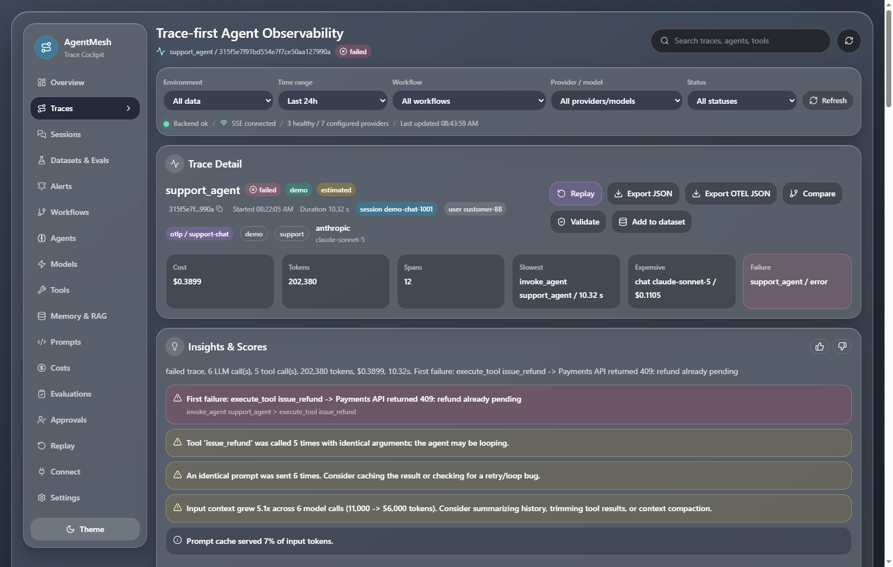
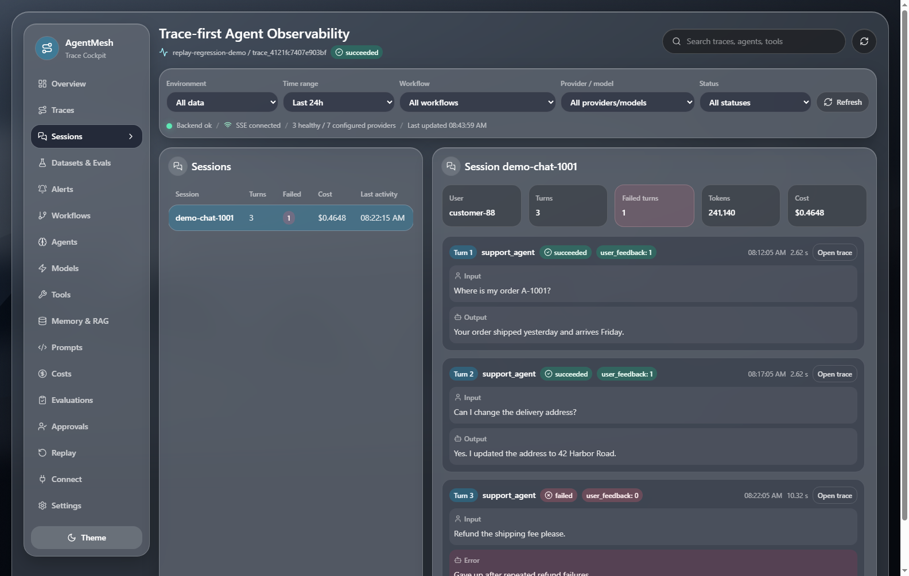
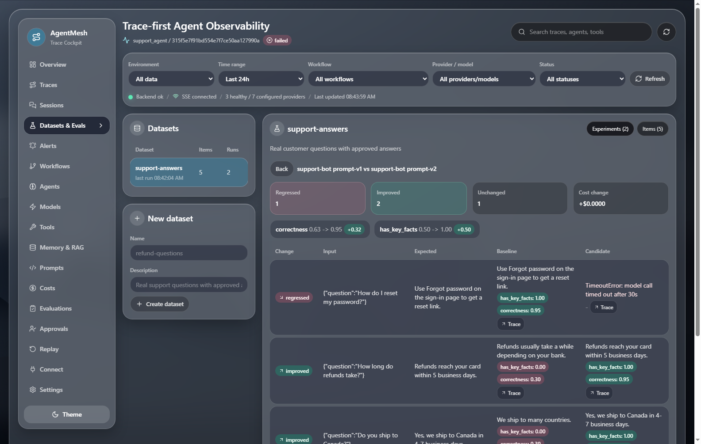
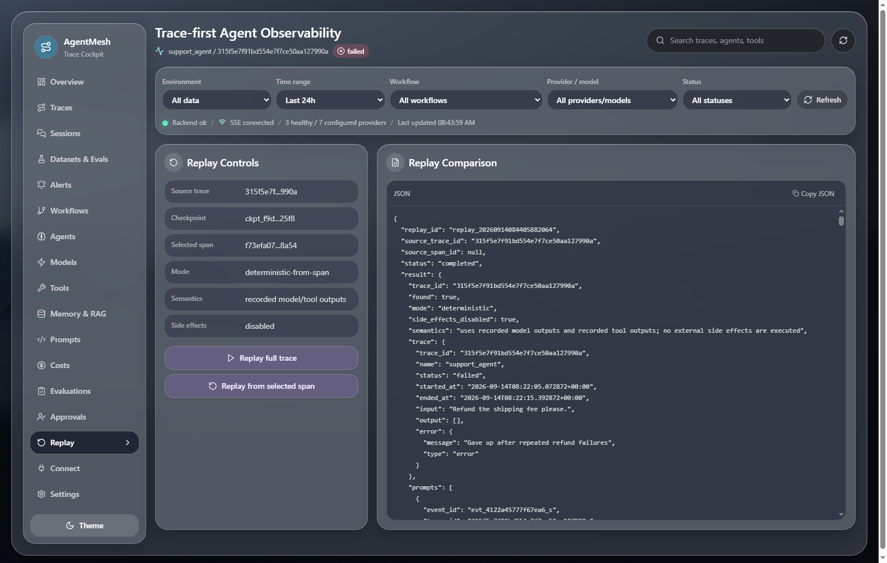

# Dashboard

The AgentMesh local dashboard is a production-oriented debugging console. Every page is built around a real use case: diagnosing a failure, understanding cost, reviewing an approval, or replaying a broken run.

---

## Starting the Dashboard

```bash
agentmesh dashboard
```

Or with explicit host and port:

```bash
agentmesh dashboard --host 127.0.0.1 --port 8787
```

Open [http://127.0.0.1:8787](http://127.0.0.1:8787) in your browser.

---

## Seeding Demo Data

To explore the dashboard with realistic data before running your own workflows:

```bash
agentmesh demo seed --reset
```

This populates the database with a set of pre-built traces covering successful runs, failures, retries, RAG retrievals, and approval events.

---

## Dashboard Pages

### Overview

The landing page. Answers: *is everything healthy right now?*

- Total runs today / this week, success/failure rate
- Average latency, total tokens, total cost
- Provider health indicators
- Budget usage progress bars
- Recent failures — click any to go straight to the trace
- Active workflow runs with live status

### Trace Explorer

The core debugging tool. Answers: *what exactly happened in this run?*



- Search and filter traces by status, workflow, provider/model, and time range
- **Insights & Scores** — the first failure and the path that led to it, tool-call loops, repeated identical prompts, context-window growth, prompt-cache hit rate, self-time and cost hotspots; click a finding to jump to its span. Thumbs up/down records user feedback as a score.
- **Session, user, source, and tag badges** for traces sent by the SDK or OpenTelemetry
- **Span tree** — nested view: workflow → agent → model call → tool call, using span names when available
- **Waterfall timeline** — horizontal bars showing timing and parallelism
- **Event table** — every recorded event in chronological order
- **Inspector** — click any span for inputs, outputs, prompt, model, and tool details
- **Export** — download as AgentMesh JSON or OTLP JSON
- **Replay** — jump straight to Replay Studio for this trace

### Sessions

Answers: *how did this conversation go, turn by turn?*



- Every session with turn count, failed turns, cost, and last activity
- Each turn's input and output (or error), status, duration, and scores, in order
- **Open trace** on any turn to debug it

Sessions come from `agentmesh.trace(session_id=...)` in the SDK or the `gen_ai.conversation.id` / `session.id` attribute on OpenTelemetry spans.

### Datasets & Evals

Answers: *did my change make the agent better or worse?*



- Datasets with item counts and last run; create a dataset or add items by hand
- **Add to dataset** on any trace copies its input (and optionally its output as the expected answer)
- Experiments per dataset with mean score and pass rate for every evaluator, errors, latency, and cost
- Open an experiment to see each item's input, expected and actual output, scores, and a link to its trace
- Pick a baseline and a candidate and **Compare**: regressed items first, score deltas, cost change

See [datasets-and-experiments.md](datasets-and-experiments.md).

### Alerts

Answers: *is anything on fire right now?*

- Rules with their condition, scope, state (firing/ok), last value, notification channel, and last fired time
- Create rules for failure rate, failed runs, spend, expensive traces, p95 latency, and tool loops
- **Test** sends a sample notification; **Check now** evaluates every rule immediately
- Recent notifications with delivery status

Links in the form `/?trace=<trace_id>` open a trace directly (alert notifications use them when `AGENTMESH_PUBLIC_URL` is set), and `/?page=datasets&experiment=<id>` opens an experiment. See [alerts.md](alerts.md).

### Workflows

Answers: *how is my pipeline structured and where did it get slow or fail?*

- Node graph built from actual trace data — agent nodes, task nodes, model nodes, tool nodes, memory nodes, approval nodes
- Each node shows status, retries, cost, and latency
- Highlight the critical path through the graph

### Agents

Answers: *which agents are most expensive or error-prone?*

- Per-agent metrics: current status, active task, token usage, cost trend over time
- Tool call count and error rate
- Memory operation history
- Recent traces the agent appeared in

### Models

Answers: *which providers are slow or failing?*

- Provider health: calls, token split, cost, latency, p95, error rate, rate-limit hits
- Compare models side by side

### Costs

Answers: *where is my budget going?*

- Spend today / this week / this month
- Budget used vs remaining with visual progress bars
- Cost by workflow, agent, model, and provider
- Failed-run waste (cost spent on runs that ultimately failed)
- Cache savings (prompt-cache hits)
- Token split: prompt vs completion

### Tools

Answers: *what did each agent actually do?*

- Every tool call with input arguments and output result
- Duration, permission level, side-effect flag
- Approval status (pending / approved / rejected)
- Sandbox logs and MCP metadata

### Memory & RAG

Answers: *which document or memory record influenced this answer?*

- Memory operations: every read/write with key, value, agent, timestamp
- Versioned records: full history for long-term memory keys
- RAG retrievals: query, chunks, similarity scores, source metadata

### Approvals

Answers: *what is waiting for my review?*

- Approval queue with tool, agent, workflow, risk level, and status
- The full tool arguments for each request
- Approve or reject in one click (the API also accepts a reason)
- History of past decisions

### Replay Studio

Answers: *what did the recorded run actually do?*



- Replay the whole trace, or from the span selected in the Trace Explorer
- Deterministic mode uses recorded model and tool outputs, with side effects disabled
- The replay result — prompts, outputs, tool calls, agent interactions, and checkpoints — as JSON

To change memory at a checkpoint and continue from there, use the CLI: `agentmesh checkpoints patch-memory <checkpoint_id> --set '{...}'` (see [replay.md](replay.md)).

### Connect

Answers: *how do I send my own agent's traces here?*

- The server's OTLP endpoint, whether protobuf ingestion is enabled, auth mode, and content-capture setting
- Copy-paste setup for any OpenTelemetry app, the Python and TypeScript SDKs, the OpenAI Agents SDK, Pydantic AI, and the MCP server

### Evaluations

Headline quality metrics and every evaluation and score, from the runtime, the SDK, the API, dashboard feedback, and OpenTelemetry evaluation events. See [evaluations.md](evaluations.md).

---

## Building the Frontend

The dashboard has two modes:

1. **HTML fallback** — FastAPI serves a minimal single-page app. Works with no build step. Good for quick local use.
2. **React build** — Full production UI with all features.

```bash
cd dashboard
npm ci
npm run build
cd ..
agentmesh dashboard
```

---

## Generating Screenshots

```bash
agentmesh demo seed --reset
agentmesh dashboard &       # start the server
cd dashboard
npm run screenshots
```

Screenshots are written to `dashboard/screenshots/` and appear in the README and this page.

---

## Live Updates

The dashboard subscribes to the server-sent event stream and refreshes shortly after new events arrive, including spans ingested over OTLP or from the SDK:

```
GET /api/events/live     (also /api/events/stream)
WS  /ws/events           (for other clients)
```

---

## Using the Dashboard with API-Key Auth

When the server runs with `AGENTMESH_AUTH_MODE=api_key`, the dashboard shows an **API key required** prompt on first load. The key is kept in that browser's local storage and sent with every API call and the live event stream. Enter a new key the same way if it changes.

---

## API Reference

See [api_reference.md](api_reference.md) for the full list of REST endpoints, query parameters, and authentication format.

---

## Light and Dark Mode

Use the **Theme** button in the sidebar or the top bar. The choice lasts for the current page session.
