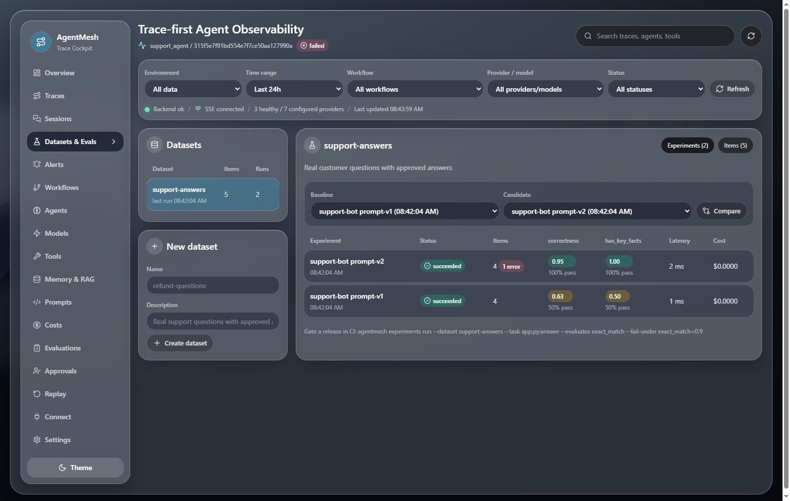

# Datasets, Experiments, and LLM-as-Judge

Catch regressions before you ship a prompt, model, or tool change:

1. **Datasets** hold test cases: an `input`, an optional `expected` output, and metadata. Add them by hand, import JSONL, or copy them from real traces with one click. Dataset names cannot contain `/`.
2. **Experiments** run your agent (any function) over every item, each inside its own trace, and score the outputs with **evaluators**.
3. **Compare** two experiments item by item: what regressed, what improved, how scores, cost, and latency moved.

Everything works the same from Python, TypeScript, the CLI, the REST API, and the dashboard (**Datasets & Evals**), on SQLite or PostgreSQL.


---

## Quick start (Python)

```python
import agentmesh
from agentmesh import Contains, ExactMatch, LLMJudge
from agentmesh.stores import create_store

agentmesh.init()                                   # local DB, or init(endpoint="http://agentmesh:8787")
store = create_store(".agentmesh/agentmesh.db")

store.create_dataset("refund-questions")
store.add_dataset_items("refund-questions", [
    {"input": {"question": "How long do refunds take?"}, "expected": "5 business days"},
    {"input": {"question": "Can I refund a gift card?"}, "expected": "Gift cards are not refundable"},
])

def answer(input):                                 # your agent, prompt, or chain; sync or async
    return my_agent(input["question"])

result = agentmesh.run_experiment(
    "refund-questions",
    task=answer,
    evaluators=[Contains(), LLMJudge("correctness", judge=call_my_llm)],
    name="prompt-v2",
)
print(result.format_summary())
```

A runnable, offline version: `python examples/datasets_experiments.py`.

- `task` receives the item's `input`. Add a second parameter named `item` to also get the whole item (expected output, metadata).
- `max_concurrency` (default 4) runs items in parallel. Inside a running event loop use `await agentmesh.arun_experiment(...)`.
- Every item runs inside a trace named `experiment:<name>` and tagged `experiment`, so spans from your agent (and auto-instrumented OpenAI/Anthropic calls) nest under it. A low score links straight to the trace that produced it.
- Scores are also attached to those traces (`source="experiment"`), so they appear on the trace detail page.
- With `init(endpoint=...)`, the dataset is loaded from the server and results are stored there.
- Pass a list of dicts instead of a dataset name to run ad hoc items. Items without an `item_id` get a stable id derived from the input, so two runs over the same inputs still compare.

## Turn traces into test cases

In the dashboard, open a trace and click **Add to dataset**. Pick or name a dataset and choose whether the recorded output becomes the expected answer (keep it checked for a good answer you want to protect; uncheck it for a bad run you want a judge to grade).

From code or the CLI:

```python
store.add_trace_to_dataset("support-regressions", trace_id)                  # root input + output
store.add_trace_to_dataset("support-regressions", trace_id, span_id=span_id)  # one span instead
store.add_trace_to_dataset("support-regressions", trace_id, expected=None)    # no reference answer
```

```bash
agentmesh datasets add-trace support-regressions <trace_id> [--span-id <span_id>] [--no-expected]
```

## Evaluators

An evaluator returns a score (0..1), a pass/fail verdict, or both, plus an optional label and comment.

| Evaluator | What it checks |
|---|---|
| `ExactMatch(case_sensitive=False)` | Output equals the expected value (strings trimmed, whitespace collapsed; objects compared as JSON) |
| `Contains(value=None)` | Output contains `value`, the expected text, or every string in an expected list (score = fraction found) |
| `RegexMatch(pattern)` | Output matches a regular expression |
| `JSONValid(required_keys=[...])` | Output parses as JSON (code fences allowed) and has the required keys |
| `Similarity(threshold=0.8)` | Character-level similarity to the expected output |
| `LLMJudge(criteria, judge=... or provider=...)` | A language model grades the output against criteria |

Write your own as a function; it receives only the arguments it declares (`input`, `output`, `expected`, `metadata`):

```python
from agentmesh import evaluator

@evaluator(name="cites_policy")
def cites_policy(output):
    return "policy" in output.lower()                 # bool -> score 1/0 and passed

@evaluator
async def answer_length(output, expected):
    return {"score": min(len(expected) / max(len(output), 1), 1.0), "comment": f"{len(output)} chars"}
```

An evaluator that raises is recorded as `label="error"` with the exception message; it does not stop the experiment.

### LLM-as-judge

```python
from openai import OpenAI
from agentmesh import LLMJudge

client = OpenAI()

def call_judge(prompt: str) -> str:
    return client.responses.create(model="gpt-5-mini", input=prompt).output_text

correctness = LLMJudge("correctness", judge=call_judge)
tone = LLMJudge("Is the reply polite and free of blame toward the customer?", judge=call_judge, name="tone")
faithful = LLMJudge("faithfulness", provider=agentmesh.AnthropicProvider(...), model="claude-haiku-4-5")
```

- `criteria` is free text or a preset: `correctness`, `helpfulness`, `conciseness`, `faithfulness`, `harmlessness`.
- The judge is asked for `{"score": <0..1>, "reason": "..."}`; the reply may be wrapped in a code fence. Replies like `Score: 4` also parse. Use `scale=(1, 5)` for a 1-5 rubric and `threshold=` for the pass mark (default 0.5).
- `template=` replaces the prompt; it may use `{criteria}`, `{input}`, `{expected}`, and `{output}`.
- Unparseable replies are recorded with `label="unparseable"` and the raw text as the comment.
- `judge=` is any sync or async function, so it works with any SDK. Judge calls made inside `run_experiment` are not billed to the item's trace.

## Score production traces (online evaluation)

```python
agentmesh.evaluate_traces(
    [LLMJudge("helpfulness", judge=call_judge), JSONValid()],
    store=store,
    limit=100,
    filters={"workflow": "support", "started_after": "2026-09-01T00:00:00+00:00"},
)
```

Each evaluator gets the trace's recorded input and output (no expected value) and saves a score on the trace with `source="evaluator"`. Traces that already have a score with the evaluator's name are skipped, so it is safe to run on a schedule.

## Compare experiments

Dashboard: **Datasets & Evals** → pick a dataset → choose a baseline and a candidate → **Compare**.



```python
comparison = store.compare_experiments(baseline_id, candidate_id)
comparison["counts"]         # {"improved": 2, "regressed": 1, "unchanged": 5, "added": 0, "removed": 0}
comparison["score_deltas"]   # {"correctness": {"base": 0.62, "candidate": 0.95, "delta": 0.33}, ...}
comparison["items"]          # regressions first, with both outputs, scores, and trace ids
```

An item **regressed** when it newly errors, newly fails an evaluator, or its score drops; **improved** is the opposite. Items are matched by `item_id`.

## Gate a release in CI

```bash
agentmesh experiments run \
  --dataset support-regressions \
  --task app/agent.py:answer \
  --evaluator exact_match --evaluator contains --evaluator app/evals.py:tone_judge \
  --fail-under exact_match=0.9 \
  --baseline exp_1234abcd --fail-on-regression
```

- `--task` and custom `--evaluator` values are `module:attribute` or `path/to/file.py:attribute`. A class is instantiated; a plain function is wrapped with `@evaluator`.
- Built-in evaluator names: `exact_match`, `contains`, `json_valid[:key,key]`, `similarity[:threshold]`, `regex:<pattern>`.
- Exit code 1 when a mean score is below `--fail-under`, or when `--fail-on-regression` is set and any item regressed against `--baseline`.
- `--json` prints the full result; `--endpoint` sends traces and results to a server instead of `--db`.

## TypeScript

```ts
import { contains, exactMatch, init, llmJudge, runExperiment } from "agentmesh-sdk";

init({ endpoint: "http://127.0.0.1:8787" });

const result = await runExperiment({
  dataset: "refund-questions",
  name: "prompt-v2",
  task: async (input) => myAgent(input.question),
  evaluators: [exactMatch(), contains(), llmJudge({ criteria: "correctness", judge: callJudge })],
});
console.log(result.summary.scores);
```

Experiments from Python and TypeScript over the same dataset compare item by item. See [typescript-sdk.md](typescript-sdk.md).

## CLI reference

```bash
agentmesh datasets list
agentmesh datasets create <name> [--description TEXT]
agentmesh datasets show <name>
agentmesh datasets add <name> --input '{"question": "..."}' [--expected TEXT_OR_JSON] [--metadata JSON]
agentmesh datasets add-trace <name> <trace_id> [--span-id ID] [--no-expected]
agentmesh datasets import <name> items.jsonl        # one {"input": ..., "expected": ...} per line, or a JSON array;
                                                    # ids already used by another dataset get new ids, so import copies
agentmesh datasets export <name> [--out items.jsonl]
agentmesh datasets delete <name>
agentmesh experiments list [--dataset NAME]
agentmesh experiments show <experiment_id>
agentmesh experiments compare <baseline_id> <candidate_id>
agentmesh experiments run --dataset NAME --task MODULE:FUNC [...]
```

## REST API

| Method | Path | Purpose |
|---|---|---|
| GET | `/api/datasets` | Datasets with item and experiment counts |
| POST | `/api/datasets` | Create: `{"name", "description", "metadata"}` |
| GET | `/api/datasets/{name_or_id}?limit=&offset=` | Dataset with a page of items (default 5000); `item_count` is the total. The SDKs read every page |
| DELETE | `/api/datasets/{name_or_id}` | Delete with its items and experiments |
| POST | `/api/datasets/{name_or_id}/items` | `{"items": [...]}` or `{"trace_id", "span_id", "use_trace_output"}` |
| DELETE | `/api/datasets/{name_or_id}/items/{item_id}` | Remove an item |
| GET | `/api/experiments?dataset=` | Experiments, newest first, with summaries and cost |
| POST | `/api/experiments` | Create or update an experiment and upsert results (used by the SDKs) |
| GET | `/api/experiments/{id}` | Experiment with per-item results, cost, and tokens |
| GET | `/api/experiments/compare?base=&candidate=` | Item-by-item comparison |
| DELETE | `/api/experiments/{id}` | Delete an experiment |

The MCP server exposes `list_experiments` and `compare_experiments`, so a coding agent can check for regressions before it opens a pull request.
