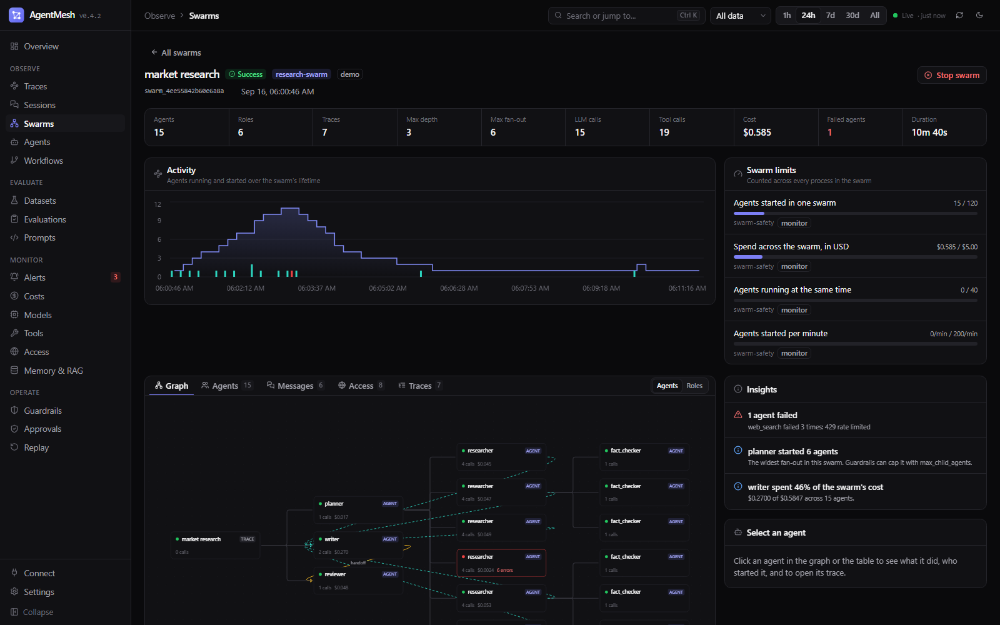

# Agent swarms

A swarm is many agents working as one run: a planner fanning research out to dozens of workers, a crawler fleet, a debate between models, a coding agent that starts sub-agents. The agents usually run in different processes or machines, so each one produces its own trace. Trace by trace, the run is invisible.

AgentMesh groups those traces into one swarm and shows it as a whole:

- **who started whom**: the spawn tree, across traces and processes;
- **who talked to whom**: agent-to-agent messages and handoffs;
- **what each agent did**: LLM calls, tool calls, tokens, cost, errors, and its trace;
- **how it behaved over time**: agents running and started, and failures;
- **what looks wrong**: failed agents, runaway fan-out, deep nesting, cost hotspots, messages to agents outside the swarm;
- **how to stop it**: one button halts every agent in the swarm, in every process.



---

## Python SDK

```python
import agentmesh

agentmesh.init(service_name="research-swarm")

with agentmesh.swarm("market research"):          # every span inside belongs to the swarm
    with agentmesh.trace("orchestrator"):
        planner()                                  # @agentmesh.observe(kind="agent")
```

Agents in the same process need nothing else: agent spans nested under other agent spans become the spawn tree.

### Workers in other processes

Pass the swarm context with the task, and start the worker's work from it:

```python
# planner (inside the swarm)
context = agentmesh.swarm_context()               # JSON: swarm id and name, plus this trace and span
queue.publish({"topic": topic, "context": context})

# worker process
task = queue.receive()
with agentmesh.trace("research", spawned_by=task["context"]):
    researcher(task["topic"])
```

`spawned_by` starts a new trace, joins the worker to the swarm, and links the trace to the planner's span (an OpenTelemetry span link with `agentmesh.link.type = spawned_by`), which is how the planner → researcher edge is drawn.

For a worker launched with a whole process per swarm, set `AGENTMESH_SWARM_ID` (and optionally `AGENTMESH_SWARM_NAME`) in its environment instead: every trace the process starts joins that swarm.

### Messages and handoffs

```python
agentmesh.send_message("writer", {"topic": topic, "notes": notes})   # inside the sending agent
agentmesh.handoff("reviewer", "Draft ready")
```

The recipient is matched by agent name; pass `to_context=` (the recipient's `swarm_context()`) when several agents share a name. Message content is recorded only when content capture is on (`AGENTMESH_CAPTURE_CONTENT`), and is truncated to 2,000 characters.

Run `python examples/agent_swarm.py` for an offline walkthrough.

---

## OpenTelemetry (any framework or language)

Swarms need no SDK. Send spans to `POST /v1/traces` with:

| What | How |
|---|---|
| Swarm membership | `agentmesh.swarm.id` (and optionally `agentmesh.swarm.name`) as a **resource** attribute or on any span of the trace. `swarm.id` / `swarm.name` also work. |
| Agent | an `invoke_agent` span with `gen_ai.agent.name`, as usual |
| Started by | a span link from the worker's span to the span that started it, with link attribute `agentmesh.link.type = spawned_by`. A trace whose span links to a trace already in a swarm joins that swarm, so workers only need the link. |
| Message / handoff | a span event named `agentmesh.agent.message` with `agentmesh.message.to`, optionally `agentmesh.message.kind` (`message` or `handoff`), `agentmesh.message.content`, and `agentmesh.message.to_trace_id` / `to_span_id` |

```python
from opentelemetry import trace
from opentelemetry.trace import Link

tracer = trace.get_tracer("worker")
parent = trace.SpanContext(trace_id=int(task["trace_id"], 16), span_id=int(task["span_id"], 16), is_remote=True)

with tracer.start_as_current_span("research", links=[Link(parent, {"agentmesh.link.type": "spawned_by"})]):
    with tracer.start_as_current_span("invoke_agent researcher", attributes={"gen_ai.operation.name": "invoke_agent", "gen_ai.agent.name": "researcher"}) as span:
        span.add_event("agentmesh.agent.message", {"agentmesh.message.to": "writer"})
```

---

## How the swarm graph is built

- **Agents** are agent spans. The root span of a trace that is not an agent (an orchestrator script, a queue consumer) is shown as a *trace* node; a trace that only wraps a single agent is folded into that agent, so 1,000 worker traces show as 1,000 agents.
- Every span belongs to its nearest agent ancestor. That is how per-agent LLM calls, tool calls, tokens, cost, and errors are counted.
- **Spawn** edges come from agent nesting and `spawned_by` links; **message** and **handoff** edges from message events.
- **Depth** counts agents started by agents; **fan-out** is how many agents one agent started.
- **Status**: a swarm is running while any of its traces runs; otherwise it takes the outcome of the traces that started it (not spawned by another trace). A worker that failed does not fail a swarm that recovered from it; failed agents are counted separately.
- The graph is computed when a swarm is opened, from what has been stored so far, so spans may arrive in any order. Up to 200,000 spans per swarm are analyzed; larger swarms show a notice.
- Retention follows traces: `agentmesh traces prune` removes a pruned trace's swarm membership, links, and messages, and a swarm with no traces left disappears.

---

## Dashboard

**Swarms** (under Observe) lists swarm runs with status, agents, failed agents, traces, calls, cost, and duration for the selected time range.

Opening a swarm shows:

- totals: agents, roles, traces, max depth, max fan-out, LLM and tool calls, cost, failed agents, duration;
- **Swarm limits**: usage against every limit a policy sets for this swarm, and a banner naming the policy when a limit halted it;
- **Activity**: agents running, started, and failed over the swarm's lifetime;
- **Insights**, each linked to the agent it is about;
- **Graph**: one card per agent, left to right by who started whom, with message and handoff edges. Swarms of more than 120 agents open grouped by **role** (agent name), with counts on nodes and edges; switch between the two at any time. Past 600 agents only the role graph is drawn — find individual agents in the Agents tab;
- **Agents**: every agent with its parent, depth, agents started, calls, cost, duration, and error; **Messages**; **Access** (hosts and stores the swarm reached, see [access.md](access.md)); **Traces**;
- a panel for the selected agent with **Open in trace**, which opens the agent's trace with its span selected;
- **Stop swarm**, which creates a swarm halt.

A trace that belongs to a swarm links to it from the trace header.

---

## Stopping a swarm

**Stop swarm** on the dashboard, `agentmesh halt create --swarm <swarm_id>`, or `POST /api/halts` with `{"scope": "swarm", "value": "<swarm_id>"}` stops every agent in the swarm at its next tool call, LLM call, or agent start, in every process that traces with the Python SDK, until the halt is released on the Guardrails page.

A swarm can also stop itself. A policy's `swarm:` block limits the swarm as a whole — agents started, agents running at once, agents started per minute, spend, tokens, and how long it has run — counted across every process, because per-trace limits cannot see the rest of the swarm:

```yaml
name: swarm-safety
mode: enforce
swarm:
  max_agents: 500
  max_concurrent_agents: 200
  max_spawn_rate_per_minute: 120
  max_cost_usd: 50
```

The server checks these every few seconds and halts a swarm that breaks one; the Swarms page shows usage against each limit, and which policy set it. Releasing that halt keeps the swarm running even if it is still over the limit. See [guardrails.md](guardrails.md#swarm-limits).

---

## CLI, API, and MCP

```bash
agentmesh swarms list [--query research] [--limit 20]
agentmesh swarms show <swarm_id> [--full]      # summary, roles, insights; --full adds every agent, edge, and message
agentmesh swarms check [--no-enforce]         # evaluate swarm limits once (the server also does this on a schedule)
```

| Method | Path | Description |
|---|---|---|
| `GET` | `/api/swarms` | Swarm runs with status, agents, failed agents, traces, calls, tokens, cost, duration. Query params: `q`, `hours`, `limit`, `offset` |
| `GET` | `/api/swarms/{swarm_id}` | Summary, agents (`nodes`), `edges`, `roles`, `messages`, `timeline`, `insights`, member `traces`, swarm-limit `usage` and `limits`, and the active `halt` |
| `POST` | `/api/swarms/check` | Evaluate swarm limits now; `?enforce=false` reports breaches without halting |

The MCP server adds `list_swarms` and `get_swarm`, so a coding agent can ask "which agents in this swarm failed, and why?".
